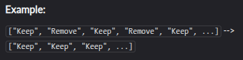

# EXERCICIOS

**(1)** Pegue um array e remova cada segundo elemento dele. Mantenha sempre o primeiro elemento
e comece a remover a partir do próximo.



Nenhuma das matrizes estará vazia, então você não precisa se preocupar com isso!

```javascript
function removeEveryOther(arr){
  const newArr = arr.filter((v, i) => i % 2 === 0)

  return newArr;
}

const func = removeEveryOther([1, 2, 3, 4, 5, 6, 7, 8, 9, 10]);

console.log(func);
```

---

**(2)** Softwares de reconhecimento de caracteres são amplamente utilizados para digitalizar textos impressos. Assim, os textos podem ser editados, pesquisados ​​e armazenados em um computador.

Quando documentos (especialmente aqueles bem antigos, escritos à máquina de escrever) são digitalizados, softwares de reconhecimento de caracteres frequentemente cometem erros.

Sua tarefa é corrigir os erros no texto digitalizado. Você só precisa lidar com os seguintes erros:

1. S é mal interpretado como 5
2. O é mal interpretado como 0
3. I é mal interpretado como 1

Os casos de teste contêm números apenas por engano.

```javascript
function correct(string) {
	const map = { '5': 's', '0': 'o', '1': 'i' };

	return string
		.split("")
		.map(char => map[char] || char)
		.join("");
}
```

---

**(3)** Seus colegas pediram que você copiasse uma folha de papel para eles. Você sabe que há 'n' colegas e a folha tem 'm' páginas.

Sua tarefa é calcular quantas páginas em branco você precisa. Se n < 0 ou m < 0, retorne 0.

```bash
n= 5, m=5: 25

n=-5, m=5:  0
```

Aguardando traduções e feedback! Obrigado!

```javascript
function paperwork(n, m) {
	let result = 0.0;

	if (n < 0 || m < 0) return 0;

	result = n * m;

	return result
}
```

---

**(4)** Escreva uma função que receba uma string de uma ou mais palavras e retorne a mesma string, mas com todas as palavras com cinco ou mais letras invertidas (como o nome deste Kata). As strings passadas serão compostas apenas por letras e espaços. Espaços serão incluídos apenas quando houver mais de uma palavra.

```bash
"Hey fellow warriors"  --> "Hey wollef sroirraw" 
"This is a test        --> "This is a test" 
"This is another test" --> "This is rehtona test"
```

```javascript
function spinWords(string){

	let newString = string.split(" ").map((value) => {

		if (value.length >= 5) return value.split("").reverse().join("");

		return value;

	});

	return newString.join(" ");

}
```

**(5)** Um isograma é uma palavra sem letras repetidas, consecutivas ou não. Implemente uma função que determine se uma string contendo apenas letras é um isograma. Suponha que a string vazia seja um isograma. Ignore maiúsculas e minúsculas.

Exemplo (Entrada --> Saída)

```bash
"Dermatoglyphics" --> true
"aba" --> false
"moOse" --> false (ignore letter case)
```

```javascript
function isIsogram(str){

	arrString = str.split("");
	count = 0;

	for (let i = 0; i < arrString.length; i++) {

		for (let o = 0; o < arrString.length; o++) {

			if (i === o) continue;

			count = (arrString[i].toLowerCase() === arrString[o].toLowerCase()) ? (count + 1) : count;

		}

	}

	if (count != 0) return false;

	return true

}

function isIsogram(str) {
  const lowerStr = str.toLowerCase();
  const uniqueChars = new Set(lowerStr);
  return uniqueChars.size === lowerStr.length;
}
```