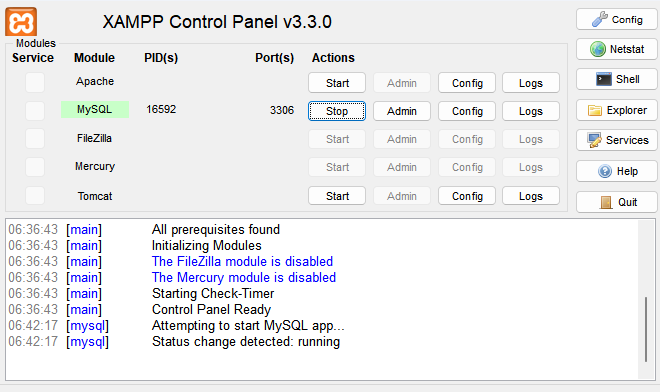
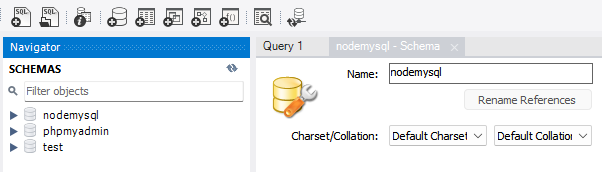

# <p id="sumario">Sumário</p>

Parte 1: <a href="#introducao" style="font-weight: bold">INTRODUÇÃO</a>

1. <a href="#conceitos-iniciais-nodejs">Conceitos inicias de NodeJS</a>
2. <a href="#npm">NPM</a>
3. <a href="#executando-node">Executando o Node</a>
4. <a href="#conceitos-iniciais-nodejs">Conceitos inicias de NodeJS</a>
5. <a href="#utilizacao-modulo">Utilização do Módulo</a>

Parte 2: <a href="#fundamentos" style="font-weight: bold">FUNDAMENTOS</a>

1. <a href="#utilizacao-modulo">Módulos</a>
2. <a href="#modulos">Import/Export</a>
3. <a href="#import-export">Core Modules</a>
4. <a href="#core-modules">Argumentos em Linha de Comando</a>
5. <a href="#argumentos-linha-comando">Módulos Externos</a>
6. <a href="#event-loop">Event Loop</a>
7. <a href="#event-emitter">Event Emitter</a>
8. <a href="#sync-async">Sync e Async</a>
9. <a href="#erros-node">Erros Node</a>

Parte 3: <a href="#introducao-core-modules" style="font-weight: bold">CORE MODULES</a>

1. <a href="#modulo-http">Módulo HTTP</a>
2. <a href="#modulo-url">Módulo URL</a>
3. <a href="#rotas-node">Rotas com Node.js</a>
4. <a href="#modulo-os">Módulo OS</a>

Parte 4: <a href="#npm-fundamentos" style="font-weight: bold">NPM - FUNDAMENTOS</a>

1. <a href="#criacao-projeto">Criação de Projeto</a>
2. <a href="#instalacao-pacotes">Instalação de Pacotes</a>
3. <a href="#dependencias-desenvolvimento">Dependências de Desenvolvimento</a>
4. <a href="#atualizacao-pacotes">Atualização de Pacotes</a>
5. <a href="#criacao-scripts">Criação de Scripts</a>
6. <a href="#instalacao-pacotes-globais">Instalação de Pacotes Globais</a>
7. <a href="#execucao-script-npx">Execução de Scripts com NPX</a>
8. <a href="#remocao-pacotes">Remoção de Pacotes</a>

Parte 5: <a href="#introducao-express" style="font-weight: bold">INTRODUÇÃO AO EXPRESS</a>

1. <a href="#introducao-sessao">Introdução</a>
2. <a href="#rotas">Rotas</a>
3. <a href="#renderizando-html">Renderizando o HTML</a>
4. <a href="#middlewares">Middlewares</a>
5. <a href="#parametros-url">Parâmetros de URL</a>
6. <a href="#enviando-dados-post">Enviando Dados com POST</a>
7. <a href="#modulo_rotas">Módulo de Rotas</a>

Parte 6: <a href="#template-engine" style="font-weight: bold">TEMPLATE ENGINE</a>

1. <a href="#handlebars">Handlebars</a>
2. <a href="#criacao-layout">Criação de Layouts</a>
3. <a href="#passando-dados-view">Passados de Dados para View</a>
4. <a href="#utilizando-condicionais">Utilizando Condicionais</a>
5. <a href="#estrutura-repeticao">Estruturas de Repetição</a>
6. <a href="#utilizando-with">Utilizando o With</a>
7. <a href="#partials">Partials</a>

Parte 7: <a href="#integracao-node-mysql" style="font-weight: bold">Integração do NodeJs com MySQL</a>

1. <a href="#instalacao-mysql">Instalação do MySQL</a>
2. <a href="#integracao-nodejs">Integração com NodeJS</a>
3. <a href="#inserindo-dados-banco">Inserindo Dados no Banco</a>
4. <a href="#resgatando-dados">Resgatando Dados</a>
5. <a href="#resgatando-dados-específicos">Resgatando Dados Específicos</a>
6. <a href="#edicao-dados">Edição de Dados</a>
7. <a href="#remocao-dados">Remoção de Dados</a>
8. <a href="#connection-pool">Connection Pool</a>
9. <a href="#preparando-query">Preparando Query</a>

Parte 8: <a href="#sequelize-nodejs" style="font-weight: bold">Utilizando Sequelize com NodeJs</a>

1. <a href="#sequelize-nodejs">ORM - Object Relational Mapper</a>
2. <a href="#instalando-sequelize">Instalando o Sequelize</a>
3. <a href="#criando-model">Criando uma Model</a>
4. <a href="#inserindo-dados">Inserindo Dados</a>
5. <a href="#lendo-dados">Lendo Dados</a>
6. <a href="#removendo-dados">Removendo Items</a>
7. <a href="#editando-itens">Editando Itens</a>
8. <a href="#reconstrucao-tabelas">Reconstrução de Tabelas</a>
9. <a href="#relacionamentos-tabelas">Relacionamentos de Tabelas</a>

Parte 9: <a href="#arquitetura-mvc" style="font-weight: bold">Arquitetura MVC</a>

1. <a href="#model">Camada do Modelo - Model</a>
2. <a href="#controller">Camada de Controle - Controller</a>
3. <a href="#view">Camada de Visualização - View</a>

<br /><br /><br />

# <p id="introducao">INTRODUÇÃO</p>

## <p id="conceitos-iniciais-nodejs">Conceitos inicias de NodeJS</p>

Node é uma runtime de javascript.

- um compilador é utilizado para realizar as execuções com a utilização de uma linguagem de mais baixo nível.
- construido na V8 engine - escrita em C++.

_Nota: node pode ser considerado uma biblioteca que vai utilizar do javascript e compilar em C++ para execução mais rápida de programas._

## <p id="npm">NPM</p>

Gerenciado de pacotes do Node: permite a utilização de bibliotecas de terceiros.

Permite a execução de determinados scripts do programa.

"Node_modules": responsável por guardar os módulos externos.

## <p id="executando-node">Executando o Node</p>

No terminal, digite: node.

- permite a criação e teste de códigos em tempo real assim como nos navegadores.

_OBS: as funções de DOM existentes em JavaScript não foram repassadas para o NodeJS._

## <p id="utilizacao-modulo">Utilização do Módulo</p>

File System: um dos principais módulos disponíveis pelo NodeJS para trabalhar com arquivos
e diretórios.

- Core Module (Sem necessidade de instalação).

"require": forma de importação padrão do NodeJS.

### File System

Principais aplicações:

1. ler arquivos.
2. criar arquivos.
3. atualizar arquivos.
4. deletar arquivos.
5. renomear arquivos.

#### ReadFile: permite a leitura de arquivos.

Ex:

```
readfile(file, encoded, callbackFunc(error, data));
```

#### Create Files

Métodos para criar novos arquivos:

- "fs.appendFile()" - anexa conteúdo específico em um arquivo.
- "fs.open()" - recebe sinalizador como segundo argumento.
- "fs.writeFile()" - substitui arquivo e conteúdo especificado.

#### Update Files

Métodos:

- "fs.appendFile()" - anexa o conteúdo especificado no final do arquivo especificado.
- "fs.writeFile()" - permite a escrita de arquivos.
  - pode está associada a um conjunto de operações.

#### Delete Files

Métodos:

- "fs.unlink()" - exclui arquivo especificado.

#### Rename files

Métodos:

- "fs.rename()" - renomeia o arquivo especificado.

<a href="#sumario" style="font-weight: bold">Sumário</a>

<br /><br /><br />

# <p id="fundamentos">FUNDAMENTOS</p>

## <p id="modulos">Módulos</p>

Scripts reaproveitáveis que podem ser categorizado como internos (desenvolvimento próprio),
core modules (disponibilizados pelo node) e externos (instalados via npm).

"module.exports": forma de importação padrão do node.

- na exportação de funções "function" não é necessário.

## <p id="import-export">Import/Export</p>

Node permite a utilização do import/export do ES6.

_OBS: para o devido funcionamento é importante que os arquivos estejam com a extensão ".mjs"._

"export default": forma de exportação padrão.

"import": forma de importação de arquivos.

## <p id="core-modules">Core Modules</p>

Permite a importação de pacotes específicos para trabalhar na aplicação.

- maior performance.

### Path

Permite trabalhar com diretórios e caminhos de arquivos.

- extrai diversas informações.

#### Métodos

1. "extname": permite obter o nome da extensão do arquivo.
2. "basename": retorna a ultima parte de um caminho.
3. "delimiter": retorna um delimitador especificado para plataforma.
4. "dirname": retorna os diretórios de um caminho.
5. "format": formata um objeto de caminho em uma string de caminho.
6. "isAbsolute": retorna um boolean se o caminho for absoluto ou não.
7. "join": une os caminhos especificados em um.
   - possibilita formar um path dinâmico, com variáveis e valores fixos.
8. "normalize": normaliza o caminho especificado.
9. "parse": formata a string de caminho em um objeto de caminho.
10. "posix": retorna um objeto contendo propriedades e métodos específicos do Posix.
11. "relative": retorna um caminho relativo de um caminho especificado para outro caminho especificado.
12. "resolve": resolve caminhos especificos em um caminho absoluto.
13. "sep": retorna o separador de seguimentos especificados para plataforma.
14. "win32": retorna um objeto contendo propriedades e métodos específicos do windows.

## <p id="argumentos-linha-comando">Argumentos em Linha de Comando</p>

process.argv: permite a leitura de arquivos que se encontram depois da chamado do script.

## <p id="modulos-externos">Módulos Externos</p>

"npm init": comando para inicializar um projeto.

"Node_modules": pasta onde será salvos os módulos instalados no projeto.

"npm install <nome>": usado para instalar os módulos.

### Pacotes

"minimist": permite a leitura de argumentos pela linha de comando.

- acessa o argumento por uma notação de array.

"chalk": melhora a visualização do console.

"readline": realiza a leitura dos dados do usuário (core module).

- createInterface: cria a entrada e saída do programa.
- alternativa "inquirer": permite resgatar e lidar com dados do usuário de forma mais completa.
  - baseado em promises.

#### Inquirer

"prompt": para realizar as perguntas é obrigatório a utilização de "name" e "message".

## <p id="event-loop">Event Loop</p>

Recurso disponível do arquitetura do Node.

- evita a ocorrência de problemas (Garante uma execução sequencial).

## <p id="event-emitter">Event Emitter</p>

Se comporta como os eventos do navegador.

- ativação do código em alguns pontos da aplicação.

core modules: "events".

## <p id="sync-async">Sync e Async</p>

Forma síncrona: códiog ser totalmente executado para prosseguir (execução sequencial).

Forma assíncrona: código progride e em ponto futuro obtém a resposta da execução assíncrona.

- um código não impede a execução do outro.

## <p id="erros-node">Erros Node</p>

throw: encerra o programa e gera um novo erro.

- programa irá ser encerrado.

try/catch: evidencia um erro em um bloco de código e exibi mensagem de erro.

<a href="#sumario" style="font-weight: bold">Sumário</a>

<br /><br /><br />

# <p id="introducao-core-modules">INTRODUÇÃO A CORE MODULES</p>

Fundamentais para criação de softwares no Node.

"http": usado para criar servidores HTTP.

- métodos usados:

  1. createServer: criação de servidores.
  2. listen: determinar a portar a ser usada.
  3. end: normalmente usado para retornar o HTML.

- uma das principais base do express.

_OBS: em aplicações web sempre ocorre uma requisição e uma resposta ao usuário._

"path": extrai informações de path de arquivos.

"fs": leitura e escrita de arquivos.

"url": usado para trabalhar com URLs.

- métodos usados:
  1. parse: permite o resgate de algumas partes da URL, por exemplo: host, path, search, query.

## <p id="modulo-http">Módulo HTTP</p>

Permite a transferência de dados através do hyper text tranfer protocol (HTTP).

"createServer()": cria um servidor HTTP que escuta as portas do servidor e retorna uma resposta ao cliente.

- argumentos "req" e "res": o primeiro representa uma requisição do cliente e o segunda a resposta para o mesmo.

### Requisição

"req.url": parte da url que vem depois do domínio.

## <p id="modulo-url">Módulo URL</p>

Endereço web dividido em parte legíveis.

Métodos:

- "url.parse()": retorna objeto URL com cada parte do endereço.

## <p id="rotas-node">Rotas com Node.js</p>

Rotas nada mais são que as páginas acessadas no site.

## <p id="modulo-os">Módulo OS</p>

Permite a extraçao de informações do sistema operacional.

<a href="#sumario" style="font-weight: bold">Sumário</a>

<br /><br /><br />

# <p id="npm-fundamentos">NPM - FUNDAMENTOS</p>

Gerenciador de pacotes do NodeJS - Node Package Manager.

funções:

- configurações de projetos.
- execução de scripts.

package.json: arquivo de configuração da aplicação.

## <p id="criacao-projeto">Criação de Projeto</p>

"npm init": comando de inicialização de projeto.

- arquivo package.json é gerado com todas as informações do projeto condensadas.
- outra forma: "npm init -y".

## <p id="instalacao-pacotes">Instalação de Pacotes</p>

"npm install <nome_pacote>": responsável pela instalação de um pacote.

_OBS: sempre que um projeto for inicializado é importante que se rode o comando "npm install" para instalar todas as suas dependências._

## <p id="dependencias-desenvolvimento">Dependências de Desenvolvimento</p>

"--save-dev": Instalação de pacotes apenas para ambiente de desenvolvimento.

- módulos não estarão presentes na build de produção.

## <p id="atualizacao-pacotes">Atualização de Pacotes</p>

Pode trazer certos benefícios como novas funcionalidades, otimização de performance e entre outras coisas.

_OBS: atualizações de pacotes sempre deve ser realizadas dentro do ambiente local antes de ser enviada para produção._

"npm update": realiza a atualização de todos os pacotes instalados no package.json.

- "npm update <nome_pacote>": atualização de pacote específico.

"npx npm-check-updates -u": executador de pacotes do Node.

- verificação de todos os pacotes que devem ser atualizados.

## <p id="criacao-scripts">Criação de Scripts</p>

O npm permite a criação de rotinas que poderão executar uma série de comandos.

"npm run <nome_script>": executa uma sequência de comanndos.

## <p id="instalacao-pacotes-globais">Instalação de Pacotes Globais</p>

Não fica salvo em um projeto específico e não fica salvo na pasta node_modules do projeto.

- flag "-g": usada para instalações globais dentro da máquina.

Exemplo:
`npm install -g <nome_pacote>`

_OBS: quando ocorrer do pacote instalado globalmente nõa ser encontrado, utilize "npm link <nome_pacote>"_

## <p id="execucao-script-npx">Execução de Scripts com NPX</p>

Utilizado em pacotes que são scripts executáveis que resultam em alguma ação no computador.

Exemplo:
`npx create-react-app`

## <p id="remocao-pacotes">Remoção de Pacotes</p>

"npm uninstall <nome_pacote>": remove um pacote do projeto.

<a href="#sumario" style="font-weight: bold">Sumário</a>

<br /><br /><br />

# <p id="introducao-express">INTRODUÇÃO AO EXPRESS</p>

## <p id="introducao-sessao">Introdução</p>

O express é um framework para backend utilizado em NodeJS utilizado principalmente na criação de aplicações web.

Caracteristicas:

1. Leve.
2. Performático.
3. simples de utilização.
4. maior versatilidade.

Funcionalidades Básicas:

1. criação de rotas.
2. renderização de páginas html.
3. conexão com base de dados.

## <p id="rotas">Rotas</p>

Presenta em todas as aplicações web que nada mais são que URLs acessadas durante uma navegação.

- atreladas a algumas funcionalidades do sistema.
- ponte entre o usuário e a lógica de programação.

Exemplo:

```
rota - /produtos

www.site.com/produtos
```

## <p id="renderizando-html">Renderizando o HTML</p>

Método "sendFile": envia um arquivo html como resposta que será renderizado na página.

### Inserindo o CSS nas páginas

Middleware "express.static": usado para inserir arquivos estáticos em páginas web.

_Nota: public é normalmente usado para guardar os arquivos estáticos que serão utilizados._

### Problema de Atualização

Módulo "Nodemon": reinicia o projeto cada salvamento, aumentando a eficiência na hora do desenvolvimento do projeto.

- normalmente salvo como dependência de desenvolvimento (--save-dev).

## <p id="middlewares">Middlewares</p>

Códigos que podem ser executados entre uma ação e outra.

_Nota: o "use" método possibilita a utilizaçõa de middlewares no express._

O middleware pode está atrelado a qualquer parte do sistema, mas o "next()" é necessário para o usuário poder prosseguir

## <p id="parametros-url">Parâmetros de URL</p>

Por meio da requisição é possível resgatar os parâmetros que estiverem presentes na URL.

Exemplo: `req.params.<name>`.

Exemplo de parâmetro: `/users/:id`.

- o nome dado ao parâmetro fica a escolha do desenvolvedor.

## <p id="enviando-dados-post">Enviando Dados com POST</p>

Um POST representa algo que foi enviado por um formulário com a intenção de inserir algo no banco.

- Uma rota será responsável por receber os dados enviados por meio do método "post" do express.

_Nota: para que seja realizada a leitura dos dados do body é importante a utilização do middleware express.json._

## <p id="modulo_rotas">Módulo de Rotas</p>

Várias rotas podem ser unificadas em um único módulo.

Benefícios:

- facilidade na correção de problemas.
- código mais estruturado.

_Nota: o arquivo que irá conter as rotas deve ser representativo para cada rota._

<a href="#sumario" style="font-weight: bold">Sumário</a>

<br /><br /><br />

# <p id="template-engine">TEMPLATE ENGINE</p>

Possibilidade de novas funcionalidades disponíveis para as views, deixando o html mais dinâmico.

- Variáveis do backend poderão ser utilizadas na frontend.
- essencial para projetos que utilizam banco de dados e não são estáticos.

Template Engine disponíveis:

1. EJS.
2. Pug.
3. Handlebars.

## <p id="handlebars">Handlebars</p>

Dados dinâmicos devem ser colocados entre "{{}}" no html para serem impressos.

- interpolação de variáveis.
- criação de condicionais e loops no template.

pacote: express-handlebars.

## <p id="criacao-layout">Criação de Layouts</p>

Layouts podem ser criados para serem reaproveitados entre as páginas.

tag especial `{{{ body }}}`: local onde o corpo do site será inserido.

## <p id="passando-dados-view">Passados de Dados para View</p>

Os dados podem ser passados utilizando o método "render", onde um objeto será enviado com chaves e valores.

- possibilita que os dados sejam acessados no template.

sintaxe: `{{ dado }}`.

## <p id="utilizando-condicionais">Utilizando Condicionais</p>

As estruturas condicionais são usadas para deixar o layout mais flexível.

sintaxe: `{{ #if ... }} ... {{ /if }}`

sintaxe com else: `{{ #if ... }} ... {{ else }} ... {{ /if }}`

## <p id="estrutura-repeticao">Estruturas de Repetição</p>

No handlebars as estruturas de repetição são feitas pelo operador "each".

sintaxe: `{{#each}} ... {{/each}}`.

Em uma lista de itens (array), o elemento atual da interação pode ser referido por meio do "{{this}}" (item atual).

## <p id="utilizando-with">Utilizando o With</p>

O "with" permite obstrair um objeto tornando a sua estrutura mais simples.

- propriedades podem ser acessadas sem a necessidade de referenciar o objeto antes.

sintaxe: `{{#with objeto}} ... {{/with}}`

## <p id="partials">Partials/p>

Os partials nada mais são que pequenos templates que precisam ser repetidos em diversos locais da aplicação.

sintaxe: `{{> partials}}`.

OBS: antes de utilizar as partials no projeto é importante configurar o handlebars na servidor.

Exemplo:

```
const hbs = exphbs.create({
    partialsDir: ["views/partials"],
});

app.engine('handlebars', hbs.engine);
```

<a href="#sumario" style="font-weight: bold">Sumário</a>

<br /><br /><br />

# <p id="integracao-node-mysql">Integração do NodeJs com MySQL</p>

Os bancos de dados relacionais são constituidos por algumas entidades que nada mais é
do que uma separação de funcionalidades.

Estrutura de um bando de dados:

1. tabelas: categorização dos dados inseridos.
2. Colunas: divisão dos dados dentro da tabela.
3. Dados: podem ser inseridos, modificados, atualizados e removidos em uma tabela (C.R.U.D).
4. Relacionamentos: ligações entre as tabelas.

_Nota: O MySQL é um SGBD (sistemas gerenciador de banco de dados)_.

## <p id="instalacao-mysql">Instalação do MySQL</p>

XAMPP: oferece ferramentas como o PHP, MySQL e Apache.

Exemplo:


Etapas para acessar o MySQL no terminal:

1. na barra de pesquisa do windows, digite: variáveis de ambiente > em propriedades do sistemas clique em variáveis de ambiente.
2. na janela que se abre procure em variáveis do sistema "Path" > clique em editar.
3. clique em Novo > coloque o caminho do XAMPP que foi determinado na instalação (Ex: C:\xampp\mysql\bin).
4. no terminal CMD, digite: `mysql -u root` para utilizar o MySQL no terminal.

## <p id="integracao-nodejs">Integração com NodeJS</p>

_OBS: informações como host, user, password e banco devem ser passados para conexão com o banco._

instalação driver: `npm i mysql`.

Exemplo: criando conexão.

```
const connection = mysql.createConnection({
    host: ...,
    user: ...,
    password: ...,
    database: ...
})
```

Para aplicação ser executada é importante que ocorra o estabelecimento conexão com o banco a cada interação.

Etapas para criação do banco no Workbench:

1. na primeira janela do Workbench, clique sobre "+" para criar uma nova conexão.
2. como a conexão é padrão, clique em ok > na nova janela vá em "create new schema".

Exemplo:


## <p id="inserindo-dados-banco">Inserindo Dados no Banco</p>

Exemplo:

```
    const sqlQuery = sql_command;

    connection.query(sqlQuery, callbackFunction(err));
```

## <p id="resgatando-dados">Resgatando Dados</p>

Exemplo:

```
app.get('/books', (req, res) => {

    connection.query(sqlQuery, callbackFunction(err, data));

});
```

## <p id="resgatando-dados-específicos">Resgatando Dados Específicos</p>

Exemplo:

```
app.get('/books/:id', (req, res) => {

    const id = req.params.id;

    connection.query(sqlQuery, callbackFunction(err, data));

});
```

## <p id="edicao-dados">Edição de Dados</p>

_OBS: o dado deve ser primeiro resgatodo para depois editar em uma rota de "post"._

_Nota: os dados podem ser retornados em um formulário para ajudar na edição e na visualização dos dados._

Exemplo: passando id no formulário sem mostrar ao usuário.

```
  <input type="hidden" name="id" value="{{book.id}}">
```

- o tipo "hidden" fica responsável por ocultar o dado.

Exemplo:

```
app.post('/books/updatebook', (req, res) => {

    const id = req.body.id;
    const title = req.body.title;
    const pageqty = req.body.pageqty;

    connection.query(sqlQuery, callbackFunction(err, data));

});
```

## <p id="remocao-dados">Remoção de Dados</p>

Exemplo:

```
app.post('/books/remove/:id', (req, res) => {

    const id = req.params.id;

    connection.query(sqlQuery, callbackFunction(err, data));

});
```

## <p id="connection-pool">Connection Pool</p>

Recurso para otimização de conexões, criando um cache e permitindo sua reutilização das querys já utilizadas.

- as requisições se tornam mais eficientes pois não será necessário ir até ao banco.
- controle de conexões.

Exemplo:

```
  const pool = mysql.createPool({
    connectionLimit: ??,
    host: ??,
    user: ??,
    password: ??,
    database: ??
});
```

- connectionLimit: a partir da quantidade informada de conexões às demais serão eliminadas.

## <p id="preparando-query">Preparando Query</p>

Forma de defesa contra SQLs Injections.

_OBS: toda aplicação que for colocada em produção deve utilizar de meios para evitar SQL Injection._

_OBS: dados provenientes de clientes devem ser tratados._

<br /><br /><br />

# <p id="sequelize-nodejs">Utilizando Sequelize com NodeJs</p>

ORM baseada em promises (then/catch).

Possui integração para vários bancos relacionais, como MySQL e PostgreSQL.

Models: reflexos das tabelas do banco de dados em uma classe.

## <p id="sequelize-nodejs">ORM - Object Relational Mapper</p>

_Nota: As tabelas da aplicação serão tratadas como objetos utilizando métodos já criados._

- queries se tornam mais abstratas.

_OBS: Em alguns casos um ORM pode trazer problemas de performance._

- query pura executam mais rapidamente que ORMs pois não há carregamento de objetos ou intâncias.

## <p id="instalando-sequelize">Instalando o Sequelize</p>

`npm i sequelize` - instalação do sequelize pelo terminal.

_OBS: É importante realizar a instalação do mysql2 para realizar a conexão do sequelize com o mysql._

Exemplo:

```
const sequelize = new Sequelize(DB_NAME, USER_NAME, PASSWORD, {
    host: HOST_NAME,
    dialect: DRIVE_DATABASE
});
```

## <p id="criando-model">Criando uma Model</p>

Para criar um model uma classe deve ser instanciada para representar uma tabela.

- responsável por operações entre a aplicação e o banco.

_Nota: o método "sync" faz a criação das tabelas baseada nos models._

Método Utilizado:

- "define": define o model a ser criado.

Exemplo:

```
const User = db.define('User', {
    name: {
        type: DataTypes.STRING,
        allowNull: false,
    }
});
```

A criação da tabela após a execução do banco permite também a sincronização com a conexão da aplicação com a base de dados.

## <p id="inserindo-dados">Inserindo Dados</p>

Método Utilizado:

- "create": utiliza como parâmetro todos os campos da tabela e insere o registro no banco.

Exemplo: `await User.create({ name, occupation, newsletter });`.

- obs: nome das variáveis devem ser iguais ao do banco.

## <p id="lendo-dados">Lendo Dados</p>

"fetchAll": utilizado para leitura de dados.

Exemplo: `await User.findAll({ raw: true });`.

Os dados são retornados em um objeto especial que pode ser transformado em um array objetos inserindo o parâmetro "raw" como true.

Para filtrar dados com sequelize o parâmetro "where" deve ser informado para não afetar os demais dados.

Exemplo:`where: objectFilter`

"findOne": retorna um único resultado.

Exemplo:

```
await User.findOne({
  raw: true,
  where: objectFilter
});
```

## <p id="removendo-dados">Removendo Items</p>

"destroy": remove itens.

Exemplo: `await User.destroy({ where: filter });`

- semelhante ao resgate de usuários.
- normalmente aplicado com POST.

## <p id="editando-itens">Editando Itens</p>

Os dados devem primeiro ser resgatados para poderem ser visualizados pelo usuário que irá atualiza-lo.

_NOTA: O método "findOne" támbem pode ser usado para buscar o único dado que será modificado._

"update": atualiza os dados através de um objeto com os itens atualizados.

Exemplo: `await User.update(userData, { where: filter });`.

## <p id="reconstrucao-tabelas">Reconstrução de Tabelas</p>

A reconstrução de tabelas pode ser forçado por meio do método sync, onde são sincronizados os models e as tabelas.

Exemplo: `sync ({ force: true })`

OBS: os dados são perdidos nesse processo.

- **NUNCA DEVE SER COLOCADO EM PRODUÇÃO**.

Aplicável em casos:

1. adição de nova coluna.
2. criação de novos relacionamentos.

## <p id="relacionamentos-tabelas">Relacionamentos de Tabelas</p>

Na maioria dos casos relacionamentos são sempre criados em banco de dados relacionais.

No sequelize é necessário que exista dois models para criação de um relacionamento.

- um dos models irá possuir um método de relacionamento para criar a relação.

_Nota: foreign key (chave estrangeira) é um dado que serve ligação entre uma tabela e outra._

_OBS: segundo a normalização de banco de dados cada tabela deve ter um único objetivo._

Exemplo:`Address.belongsTo(User)` - um endereço pertence a um usuário.

### Resgatando Dados Relacionados

Uma relação entre Models deve existir, onde por meio do operador "include" com o nome do model será possível resgatar o dado.

- Registros associados também podem ser retornados na seleção.

Nota: neste caso o parâmetro raw deve ser removido, caso contrário os dados serão retornados em um único array dificultando a visualização.

Exemplo: `User.findOne({ include: Address, where: { id: id } });`.

- todos os endereços relacionados ao id do usuário serão resgatados.

Exemplo: `user.get({ plain: true})`.

- recebe os dados sem a presença do parâmetro "raw".
- relações entre models devem estar bem definidas, caso contrário um erro "Address is not associated to User" pode surgir.

### Removendo Dados Relacionados

_Nota: Assim como os demais processos de remoção de dados abordados até aqui, o mesmo irá se aplicar para dados relacionados._

No caso de dados relacionados, se um registro pai for removido os demais registros que estão interligados a ele também serão eliminados.

Etapas:

1. criação de formulário para envio de id do item.
2. rota que recebe informações e executa a remoção utilizando o método "destroy".

<a href="#sumario" style="font-weight: bold">Sumário</a>

<br /><br /><br />

# <p id="arquitetura-mvc">Arquitetura MVC - Model View Controller</p>

Padrão arquitetural em sistemas da informação utilizado em diversos frameworks.

Benefícios:

1. maior organização do código.
2. facilidade de manutenção.
3. aplicação dividida em camadas.

## <p id="model">Camada do Modelo - Model</p>

Camada responsável por interagir diretamente com o banco de dados, além de ser o meio de interação entre a base e os controllers.

Principais responsabilidade:

- resgate.
- atualização.
- remoção.
- criação.

_Nota: models são aqueles que controlam a arquitetura do sistemas, tendo toda a regra de negócio da aplicação._

Composição da Estrutura:

1. "controllers".
2. "models".
3. "views".
4. "routes".
5. "index.js": arquivo de inicialização da aplicação.

## <p id="controller">Camada de Controle - Controller</p>

Meio que serve para interliga as camadas de model e view, tendo como principal função o processamento de dados que estão vindo do banco ou da view.

Classe que contém as funções com a lógica de cada rota.

_Nota: Para os dados poderem ser salvos no banco, é necessário que haja um vinculo entre o controller e o model._

Exemplo: `await Task.create(task);` - salva os dados no banco.

_Nota: normalmente cada controller tem seu próprio arquivo de rota._

### Remoção de Dados

Método destroy - método de sequelize utilizado na remoção de dados.

- normalmente este tipo de função é condicionado por um POST.

## <p id="view">Camada de Visualização - View</p>

Representa o frontend da aplicação, onde normalmente os dados serão apresentados ao usuário.

Os controllers servem como meio de passagem dos dados que irão ser apresentados nas views.

_OBS: lógica/regra de negócios não devem está presente dentro da views._

<a href="#sumario" style="font-weight: bold">Sumário</a>
