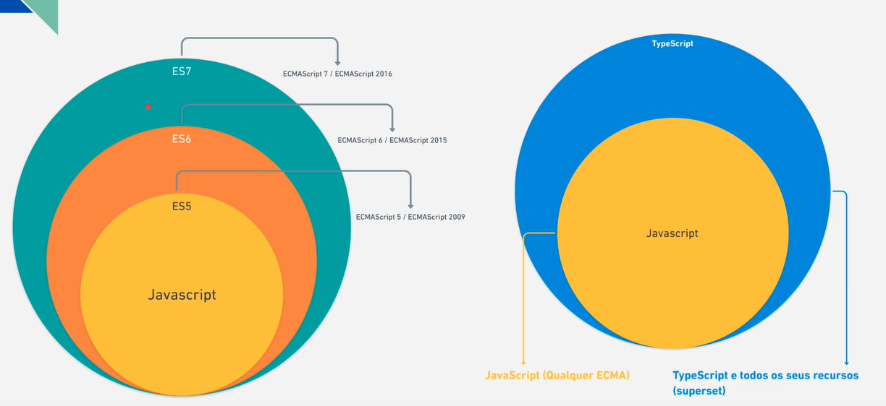
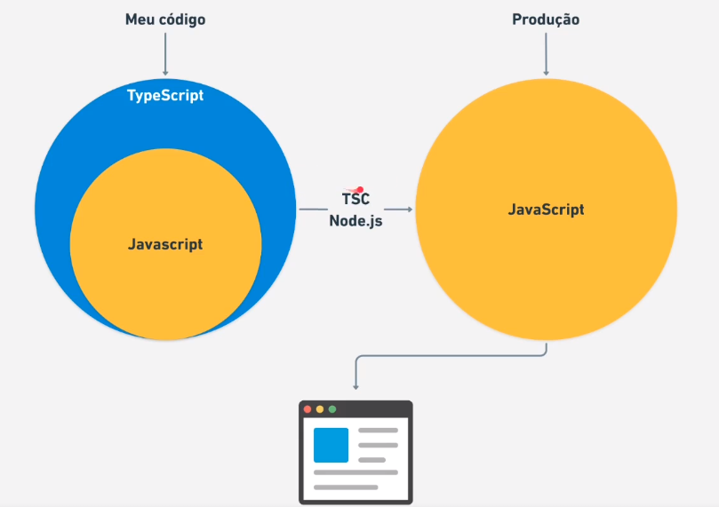
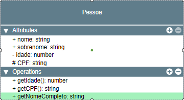
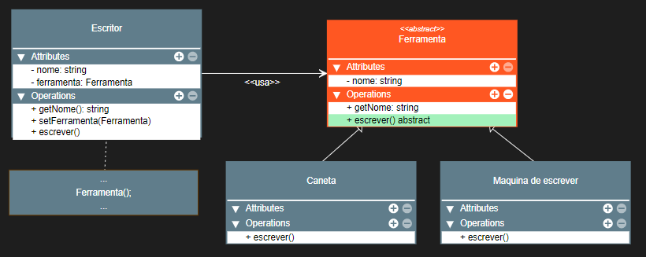
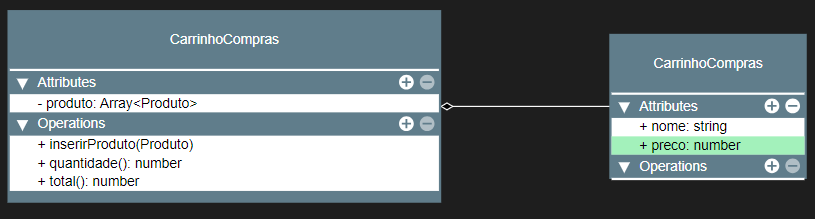

# TYPESCRIPT

# <p id="sumario">SUMÁRIO</p>

Parte 1: <a href="#introducao" style="font-weight: bold">INTRODUÇÃO</a>

1. <a href="#definicao-typescript">Definição do TypeScript</a>
2. <a href="#instalando-typescript">Instalando o TypeScript</a>
3. <a href="#configurando-code-runner">Configurando o Code Runner</a>
4. <a href="#configurando-eslint">Configurando o Eslint</a>
5. <a href="#instalando-configurando-prettier">Instalando e Configurando o Prettier</a>
6. <a href="#configurando-typescript">Configuração do TypeScript</a>
7. <a href="#editor-config">Editor Config</a>

---

Parte 2: <a href="#tipos-basicos" style="font-weight: bold">TIPOS BÁSICOS</a>

1. <a href="#type-annotation">Type Annotation</a>
2. <a href="#tipo-any">Tipo Any</a>
3. <a href="#tipo-void">Tipo Void</a>
4. <a href="#objetos">Objetos</a>
5. <a href="#tuple">Tuple</a>
6. <a href="#nun">Null, Undefined e Never</a>
7. <a href="#enum">Enum</a>
8. <a href="#unknown">Unknown</a>
9. <a href="#union-types">Union Types</a>
10. <a href="#tipos-literais">Tipos Literais</a>
11. <a href="#types-alias">Types Alias</a>
12. <a href="#intersection-type">Intersection Type</a>
13. <a href="#type-functions">Type Functions</a>
14. <a href="#structural-type">Strutural Type</a>
15. <a href="#type-assertions">Type Assertions</a>
16. <a href="#webpack">Configuração do Webpack</a>
17. <a href="#this-function">This - Function e Arrow Functions</a>

---

Parte 3: <a href="#poo" style="font-weight: bold">PROGRAMAÇÃO ORIENTADA A OBJETO</a>

1. <a href="#pilares">Pilares</a>
2. <a href="#classes">Classes</a>
3. <a href="#tsconfig-json">Tsconfig.json</a>
4. <a href="#modificadores-de-acesso-public-e-private">Modificadores de Acesso: Public e Private</a>
5. <a href="#heranca">Herança</a>
6. <a href="#super-classes-ou-bases-classes">Super Classes ou Bases Classes</a>
7. <a href="#modificador-de-acesso-protect">Modificador de Acesso: Protect</a>
8. <a href="#getter-e-setter">Getter e Setter</a>
9. <a href="#atributos-e-metodos-estaticos">Atributos e Métodos Estáticos</a>
10. <a href="#construtores-privados-e-singleton">Construtores Privados e Singleton</a>
11. <a href="#associacao-de-classes">Associação de Classes</a>
12. <a href="#agregacao">Agregação</a>
13. <a href="#composicao-entre-classes">Composição Entre Classes</a>
14. <a href="#implementando-type-alias-em-classes">Implementando Type Alias em Classes</a>
15. <a href="#interfaces">Interfaces</a>
16. <a href="#declaration-merging-em-interfaces">Declaration Merging em Interfaces</a>

---

Parte 4: <a href="#tipos-avancado" style="font-weight: bold">TIPOS AVANÇADOSO</a>

1. <a href="#type-guard">Type Guard</a>
2. <a href="#keyof-e-typeof">Keyof e Typeof</a>
3. <a href="#chaves-como-type">Chaves como Type</a>
4. <a href="#this-como-type">This como Type</a>
5. <a href="#overload-de-metodos-e-funcoes-em-typescript">Overload de Métodos e Funções em TypeScript</a>
6. <a href="#encadeamento-opcional-e-operador-de-coalescencia-nula">Encadeamento Opcional e Operador de Coalescência Nula</a>

---

Parte 5: <a href="#generics-intro" style="font-weight: bold">GENERICS INTRO</a>

1. <a href="#arrays-e-promises-generics">Arrays e Promises Generics</a>
2. <a href="#generics-com-interfaces-e-types-alias">Generics com Interfaces e Types Alias</a>
3. <a href="#constraints-generics">Constraints Generics</a>
4. <a href="#generics-com-classes">Generics com Classes</a>
5. <a href="#generics-com-intersections">Generics com Intersetions</a>
6. <a href="#type-predicate">Type Predicate</a>
7. <a href="#utility-generics">Utility Generics</a>

---

Parte 6: <a href="#decorator" style="font-weight: bold">DECORATOR</a>

1. <a href="#decorator-factories">Decorator Factories</a>
2. <a href="#method-decorator">Method Decorator</a>
3. <a href="#parameters-decorator">Parameters Decorator</a>
4. <a href="#property-decorator">Property Decorator</a>

---

Parte 7: <a href="#namespace-modules" style="font-weight: bold">NAMESPACE MODULES</a>

1. <a href="#importando-javascript-no-typescript">Importando JavaScript no TypeScript</a>
2. <a href="#utilizando-bibliotecas-de-terceiros">Utilizando Bibliotecas de Terceiros</a>
3. <a href="#estendeno-tipos-de-bibliotecas">Estendeno Tipos de Bibliotecas</a>

---

Parte 8: <a href="#principio-solid" style="font-weight: bold">PRINCÍPIOS S.O.L.I.D</a>

1. <a href="#single-responsibility-principle">Single Responsibility Principle</a>
2. <a href="#open-closed-principle">Open/Closed Principle</a>
3. <a href="#liskov-substitution-principle">Liskov Substitution Principle</a>
4. <a href="#interface-segregation-principle">Interface Segregation Principle</a>
5. <a href="#dependency-inversion-principle">Dependency Inversion Principle</a>
6. <a href="#vantagens-e-desvantagens-de-aplicar-os-principios-do-solid">Vantagens e Desvantagens de Aplicar os Princípios do S.O.L.I.D</a>

---

Parte 9: <a href="#jest" style="font-weight: bold">JEST</a>

1. <a href="#assercões-com-jest">Asserções com Jest</a>
2. <a href="#tipos-de-testes">Tipos de Testes</a>
3. <a href="#teste-com-spyn">Teste com Spyon</a>
4. <a href="#testando-com-mocks">Testando com Mocks</a>
5. <a href="#teste-coverage">Teste Coverage</a>

---

# <p id="introducao">INTRODUÇÃO</p>

## <p id="definicao-typescript">DEFINIÇÃO DO TYPESCRIPT</p>

<a href="./a1_intro/src/inital.ts">Visualizar script</a>

superset para JavaScript com tipagem estática, novos recursos e compila para o JavaScript Puro.




> OBS: O CÓDIGO TYPESCRITP DEVE SER COMPILADO PARA JAVASCRIPT PURO, ASSIM ELE PODERÁ SER RODADO NO NODE E NO BROWSER.

- conversão de código: possibilita a escolha da versão do ECMAScript.

_NOTA: o Dino já consegue entender o código feito em typescript no backend._

| Tipagem estática |
|------------------|

define os tipos dos valores que serão passados para funções, variáveis e etc.

**benefícios**:

1. código apresenta maior segurança.
2. evita mais erros de código.

Exemplo: Javascript Puro

```typescript
function multiplyNumbers(x, y){
    return x * y;
}

const result = multiplyNumbers(10, [1, 2]);
console.log(result);
```

Ex: TypeScript

```typescript
function multiplyNumbers(x: number, y: number){
    return x * y;
}

const result = multiplyNumbers(10, [1, 2]);
console.log(result);
```

- neste código, o typescript irá informar que ocorre um erro ao lançar um array dentro da função, que deveria apenas receber números.

| Novos Recursos |
|----------------|

Exemplo: interfaces e classes.

```typescript
interface Nome{
    nome: string;
}

class Aluno implements Nome {
    constructor(
        public readonly nome: string,
        private readonly idade: number,
    )
}

const aluno = new Aluno('Luiz', 30);
```

**interface**: tipo de contrato que informa a classe que o campo nome, deve ser do tipo string.

**modificadores de acesso**: informa se um campo é public ou private.

_NOTA: os tipos definidos, serão eliminados em produção._

Exemplo: classes.

```typescript
abstract class Animal{
    abstract makeNoise(): void;
}

class Dog extends Animal{
    constructor(private readonly name: string){
        super();
    }

    makeNoise(): void {
        console.log(`${this.name} is baking`);
    }
}

const dog = new Dog('Tina');
```

- abstract: trabalha como um contrato com a class Dog, que obriga a class a definir o método makeNoise().

_Nota: typescript também é multiparadigma, ou seja, suporta vários paradigmas de programação e o utiliza para solução de diversos problemas._

Exemplo: definindo o tipo de uma função.

```typescript
    type calculateFN = (x: number, y: number) => number;

    const add: calculateFN = (x, y) => x + y;
    const sub: calculateFN = (x, y) => x - y;
    const mul: calculateFN = (x, y) => x * y;
    const div: calculateFN = (x, y) => x / y;

    const twoPlusTwo = add(2, 2);
    const twoMinusTwo = sub(2, 2);
    const twoTimeTwo = mul(2, 2);
    const twoDivideTwo = div(2, 2);
```

**`type`**: define uma assinatura que irá fazer com que todas as funções que a implementarem, recebam calculateFN como um tipo. Assim, não será necessário digitar o tipo, pois ele já foi definido em calculateFN.

Exemplo: criando um enum.

```typescript
// funciona como uma multipla escolha.

// função só pode receber as strings definidas no tipo Languages, caso contrário, será gerado um erro.

// checagem em tempo real.
    type Languages = 'Python' | 'JavaScript' | 'TypeScript';

    function favoriteLanguage(language: Languages) {
        return `Your like ${language}`
    }
```

_NOTA: O typescript já consegue definir um tipo por meio da inferência, não sendo necessário definir o tipo em alguns casos._

## <p id="instalando-typescript">INSTALANDO O TYPESCRIPT</p>

```bash
# No terminal, digite:
    npm i typescript -D
```

Em node_modules, uma pasta typescript é gerada, possuindo uma pasta `bin` com tsc e tsserver.

- **tsserver**: muito utilizado com editores que irá rodar o typescript em background checando o código.
- **tsc**: utilizado em desenvolvimento para compilar os scripts typescript para javascript.

```bash
# Compilando o código:
npx tsc script_name.ts

# `npx`: deve ser usado quando extensão estiver devdependences.

# ao rodar, um script js será gerado (Usado em produção).
```

| Modos de Operação |
|-------------------|

**mode modules**: export/import.

**script mode**: arquivo javascript.

- escopo global do typescript.

## <p id="configurando-code-runner">CONFIGURANDO O CODE RUNNER</p>

| Instalando ts node |
|--------------------|

```bash
# no terminal, digitar:
npm i ts-node -D
```

_Nota: Crie uma pasta .vscode: usada para configurar o vscode._
- arquivo referente a um único projeto.

```bash
# criando uma configuração.
{
    "code-runner-executeMap":
}

# Retorna todas as configurações padrões.
```

```bash
# compilando e executando com code runner.

{
    "code-runner.executorMap": {
        "typescript": "npx ts-node --files --transpile-only",
    }
}

# npx: usado para executar no projeto local.
# '--files': utiliza include e exclude do ts-config.json
```

_Nota: sempre utilize o npx para execuções locais_

## <p id="configurando-eslint">CONFIGURANDO O ESLINT</p>

```bash
# digitar no terminal
npm i eslint -D

# ainda no terminal:
# --> integra o typescript com o eslint.
npm i @typescript-eslint/eslint-plugin @typescript-eslint/parser -D

# crie um arquivo eslint na raiz, nome arquivo:
.eslintrc.js.
```
## <p id="instalando-configurando-prettier">INSTALANDO E CONFIGURANDO O PRETTIER</p>

Server para correção de erros do código.

```bash
# digite no terminal:
npm i prettier eslint-config-prettier eslint-plugin=prettier -D

# se ocorrer um erro de instalação, instale cada uma das extensões separadamente.

# após instalar, entrar em .eslintrc.js > em extends, inserir:
plugin:prettier/recommend

# criar arquivo na raiz, nome:
prettierrc.js.

# digitar:
module.exports = {
    semi: true, // sempre requerer ; no código
    trailingComma: 'all', // sempre deixar vírgula pendente em caso de objetos
    singleQuote: true, // habilita as aspas simples.
    printWidth: 80, // largura máxima da linha para realizar a quebra.
    tabWidth: 2, // largura do tab
};
```

## <p id="configurando-typescript">CONFIGURAÇÃO DO TYPESCRIPT</p>

> OBS: IMPORTANTE TER INSTALADA O TSC.

**Etapas de instalação**:

1. digite no terminal: `npx tsc --init`.
2. um arquivo tsconfig.json será gerado.
3. comando para compilar o código: `npx tsc`.

_Nota: após compilar, uma pasta dist será criada._

- NUNCA MODIFICAR OS SCRIPTS DELA.

tsconfig.json:

- **CompileOptions**
  - `target`: especifica versão do ecmascript que está no ambiente que o código será rodado.
  - `module`: normalmente configurado com o common.js que é do node.
  - `lib`: informar o que será usado no projeto.
    - Ex: "lib": ["ESNext", "DOM"].
  - `outdir`: informa a pasta que será disponibilizados os arquivos de compilação.
  - `strist`: serve como restrição para o typescript.
  - `esModuleInterop`: permite trabalhar em módulos.
- **includes**: pastas de entrada do projeto.

## <p id="editor-config">EDITOR CONFIG</p>

Cria configurações iguais para todos os editores.

Para criar, abertar botão direito do mouse > selecionar: `generate editorconfig`.

<a href="#sumario" style="color: red; font-weight: bold; font-size: 15px;">--Sumário--</a>

---

# <p id="tipos-basicos">TIPOS BÁSICOS</p>

## <p id="type-annotation">TYPE ANNOTATION</p>

<a href="./a2_tipos_basicos/src/type_annotation/a1_typeAnnotation.ts">Visualizar Script</a>

```typescript
# sintaxe básica para variáveis.
const variavel: string;

# os dois pontos seguidos de um tipo representam o type annotation
```

> OBS: os tipos que já existem no javascript devem ser escritos com letra minusculas.

```typescript
const nome: string = 'Diogo';

// # TIPO GENÉRICO
// # --> tem uma ideia de função, onde é necessário passar argumentos. Neste caso, o tipo do array deve ser informado.
let arrayNumeros: Array<T>  = valor_atribuido;

// # OUTRO MODO DE CRIAÇÃO DE ARRAY
let arrayNumeros: number[] = valor_atribuido;
```

> OBS: o caractere **`?`**, serve para deixar um valor como opcional,ou seja, ele pode ser undefined ou pode receber um valor.

```typescript
let pessoa: {
chave?: valor
}
```

```typescript
// O tipo retornado será number, dado por inferência
function soma(x: number, y: number) {
    return x + y;
}
```

## <p id="tipo-any">TIPO ANY</p>

<a href="./a2_tipos_basicos/src/type_annotation/a2_typeAnyVoid.ts">Visualizar Script</a>

Representa nada mais que uma falta de tipo.

- para corrigir o erro, coloque qualquer tipo.

> OBS: o tipo `ANY` só pode ser utilizado em alguns casos específicos.

## <p id="tipo-void">TIPO VOID</p>

<a href="./a2_tipos_basicos/src/type_annotation/a2_typeAnyVoid.ts">Visualizar Script</a>

Representa um retorno vazio.

Uma função pode ser tipada com void caso nenhum retorno seja realizado, caso contrário, ela pode assumir algum tipo dependendo do retorno.

```bash
function soma(x: number, y: number): void {
  x + y;
}
```

## <p id="objetos">OBJETOS</p>

<a href="./a2_tipos_basicos/src/type_annotation/a3_object.ts">Visualizar Script</a>

> OBS: a partir do momento que o typescript inferir o tipo, este tipo não poderá ser mais modificado.

```typescript

const objetoB: Record<chave, valor> = {
chaveA: 'Valor A',
chaveB: 'Valor B',
};

const objetoC: {
chaveA: tipo;
chaveB: tipo;
chaveC?: tipo;
[key: tipo]: tipo;
};

```

**index signatures**: permite inferir um tipo tanto para chave quanto para o valor.

_Nota: dentro da hierarquia, unknown vem antes de any._

```typescript
// # readonly - faz com que um valor não possa mais ser alterado.

Const objetoC: {
readonly chaveA: string;
chaveB: string;
} = {
chaveA: 'valor A',
chaveB: 'valor B'
}

```

## <p id="tuple">TUPLE</p>

<a href="./a2_tipos_basicos/src/type_annotation/a4_tuple.ts">Visualizar Script</a>

Este tipo é parecido com um array com tipos específicos e tamanho fixo.

Exemplo:
```typescript
// o tipo esta sendo colocado para cada indice dentro do array

export const dadosClient: [tipo1, tipo2] = [valor1, valor2];
```

_Nota: um erro pode ser ocacionado ao utilizar pop() para remover um valor do array que deveria ser obrigatório, para evitar isso, utilize readonly._

```typescript
// criando um array imutável

const array: readonly string[] = ['Diogo', 'Mello'];
```

## <p id="nun">NULL, UNDEFINED e NEVER</p>

<a href="./a2_tipos_basicos/src/type_annotation/a5_nullUndefinedNever.ts">Visualizar Script</a>

`Undefined` - normalmente ocorre quando algum tipo ainda não foi definido dentro do código.

Um **parâmetro opcional** pode assumir um valor undefined, caso não seja informado nada para ele.

> OBS: quando houver a presença de `Any` ou `Unknow`, uma checagem deve ser realizada para identificar o tipo.

_Nota: o **retorno null** pode ser utilizado quando se esta fazendo a checangem de algum erro._

`Never` - significa que nunca (afirmação) vai haver retorno de nada, diferente de void que apenas não retorna nada.

- utilizado para **tratamento de erros** ou para criar **loops infinito**.

## <p id="enum">ENUM</p>

<a href="./a2_tipos_basicos/src/type_annotation/a6_Enum.ts">Visualizar Script</a>

Representa uma estrutura de dados não ordenada, utilizada quando há mais de uma opção para alguma coisa (ex: enumarer algo).

- cada valor dentro desta estrutura será enumerado.

Exemplo:

```typescript
// # SINTAXE
// enum TipoCriado { chave=valor }

// # ESTRUTURA
enum Cores {
  VERMELHO = 10, // 0
  AZUL = 20, // 1
  AMARELO = 30, // 2
  ROXO = 'ROXO',
}
```

- enum já representa um tipo e um valor.

Exemplo: formas de representação.

```typescript
// # ÍNDICES SEM VALOR
enum Cores {
VERMELHO, // 0
AZUL, // 1
AMARELO, // 2
}

// # INSERINDO VALOR AOS ÍNDICES
enum Cores {
VERMELHO = 10, // 0
AZUL = 20, // 1
AMARELO = 30, // 2
}

// # --> neste último enum criado, como o valor para roxo foi uma string, um erro será gerado porque o typescript não sabe continuar.
// # --> - Um novo inicializador numérico deve ser criado para solucionar o problema.
enum Cores {
VERMELHO = 10, // 0
AZUL = 20, // 1
AMARELO = 30, // 2
ROXO = 'ROXO',
}
```

- os valores dos índices podem ou não ser inseridos.

> OBS: ESTE TIPO NÃO OFERECE UMA GRANDE SEGURANÇA DENTRO DO CÓDIGO.

## <p id="unknown">UNKNOWN</p>

<a href="./a2_tipos_basicos/src/type_annotation/a7_unknown.ts">Visualizar Script</a>

Tem o mesmo funcionamento de um any, só que apresenta uma maior segurança dentro do código.

O typescript não permite a execução do código sem uma verificação no tipo **unknown**, ao contrário do any que iria permitir o funcionamento normal.

- exibe um erro informando que deve ser feito a checagem de tipos, antes de realizar qualquer operação.

Exemplo:
```bash
let number2: unknown;

if (typeof number2 === 'number') console.log(number2 + y);
```

## <p id="union-types">UNION TYPES</p>

<a href="./a2_tipos_basicos/src/type_annotation/a8_unionTypes.ts">Visualizar Script</a>

Informa que um parâmetro ou função pode receber mais de um tipo.

O typescript pode lançar um erro informando que a operação está incorreta, pois uma função/parâmetro não pode ter dois tipos. Para solucionar isso, realize uma checagem dentro do código.

Exemplo:
```bash
export function addOrConcat(
  a: number | string,
  b: number | string,
): number | string {
  if (typeof a === 'number' && typeof b === 'number') return a + b;
  if (typeof a === 'string' && typeof b === 'string') return a + b;
}
```

## <p id="tipos-literais">TIPOS LITERAIS</p>

<a href="./a2_tipos_basicos/src/type_annotation/a9_tiposLiterais.ts">Visualizar Script</a>

Utilização de valores como tipo.

- uma variável não poderá ser modificada para outro valor, exemplo: const y = 10.

Exemplo: sintaxe.

```bash
# O valor de a só pode ser 100
let a: 100 = 100;

# O valor para chave nome só pode ser 'Diogo'
const pessoa = {
nome: 'Diogo' as const,
sobrenome: 'Mello',
};
```

_Nota: os tipos literais normalmente são sub-tipos de outros tipos reais._

## <p id="types-alias">TYPES ALIAS</p>

<a href="./a2_tipos_basicos/src/type_annotation/a10_typeAlias.ts">Visualizar Script</a>

Criação de apelido para algum tipo.

- esses tipos sempre devem começar com letras maiúsculas.

Exemplo:

```bash
# SINTAXE
type nomeAlias = tipo;

type nomeAlias = {
nome: tipo;
salario: tipo;
corPreferida?: tipo;
};

# ESTRUTURA
type Idade = number;

type Pessoa = {
  nome: string;
  idade: Idade;
  salario: number;
  corPreferida?: string;
};
```

## <p id="intersection-type">INTERSECTION TYPE</p>

<a href="./a2_tipos_basicos/src/type_annotation/a11_intersectionType.ts">Visualizar Script</a>

Tem a mesma ideia do Union type, mas em vez de ser OR "|", este utiliza AND "&".

- tratado como interseção de um conjunto.

Exemplo:
```bash
type TemNome = { nome: string };
type TemSobrenome = { sobrenome: string };
type TemIdade = { idade: number };
type Pessoa = TemNome & TemSobrenome & TemIdade;
```

## <p id="type-functions">TYPE FUNCTIONS</p>

<a href="./a2_tipos_basicos/src/type_annotation/a12_funcaoType.ts">Visualizar Script</a>

Exemplo:
```bash
type nomeFuncao = (parâmetro: tipo) => tipo;
```

- possui o mesmo formato de uma arrow function.

_Nota: código irá apresentar uma melhor fluidez._

## <p id="structural-type">STRUCTURAL TYPE</p>

<a href="./a2_tipos_basicos/src/type_annotation/a13_structuralType.ts">Visualizar Script</a>

Sistema de tipos que representa uma tipagem estruturada.

- somente as restrições para um determinado tipo que importa, ou seja, o conteúdo da interfaces é mais importante.

_Nota: uma dica para trabalhar com linguagens fortemente tipadas, é escrever o tipo antes de escrever o código em si._

## <p id="type-assertions">TYPE ASSERTIONS</p>

<a href="./a2_tipos_basicos/src/type_annotation/a14_typeassertion.ts">Visualizar Script</a>

Representa a conversão de um tipo para outro.

- permite acesso aos valores de um tipo através de um valor concreto.

Exemplo:
```bash
const body1 = document.querySelector('body') as HTMLBodyElement;
body1.style.background = 'red';
```

> OBS: importante que em tsconfig esteja com o DOM em lib.

**Non-Num Assertion** - informa que um objeto não pode ser nulo.

_Nota: o simbolo !, diz que não pode ser nulo_.
- não é o método mais indicado, utilize type assertion no lugar.

Ex:

```bash
const body = document.querySelector('body')!;
body.style.background = 'red';
```

- caso 2 tipos sejam assumidos, com a presença de exclamação, o valor nulo será rejeitado.

> OBS: somente sub-tipos podem ser utilizados nesse método.

## <p id="webpack">CONFIGURAÇÃO DO WEBPACK</p>

**Bundle** - método que irá unir o projeto em um único arquivo.

Os arquivos gerados no projeto pelo webpack, são responsáveis apenas pelo frontend.

- modificações foram realizadas no arquivo de configuração.

| **Instalação necessárias** |
|----------------------------|

Instalações de devdependences:
```bash
# loader do typescript para webpack
`npm i ts-loader -D`

`npm i webpack webpack-cli -D`.
```

| **Configuração** |
|------------------|

> OBS: IMPORTANTE QUE ESTEJA NA RAIZ DO PROJETO.

**source-map**: mapeia os arquivos javascript gerados pelo webpack para o arquivo typescript.

> OBS: MUDAR OUTDIR DO TSCONFIG PARA: ./frontend/assets/js.

Informações de configuração:

1. **entry**: arquivo de entrada.

2. **resolve**: utilizado para resolução de modulos.

3. **output**: possui o nome do arquivo de saida e a pasta do arquivo de saida.

| **Teste de funcinamento** |
|---------------------------|

digitar no terminal:
```bash
npx webpack

# pode ser inserida a tag -w logo após webpack para ficar assistindo.
# coloque em scripts do package.json
"build:frontend": "webpack -w"` e `"build:backend": "tsc"

# rode no terminal:
npm run build:frontend
```

| **Informações extras** |
|------------------------|

Backend: todos os arquivos serão gerados na mesma estrutura de pastas.

Frontend: único arquivo será gerado a partir do webpack.

- tsconfig.frontend.json, esta responsável por jogar os arquivos para pasta de frontend.

## <p id="this-function">THIS - FUNCTION E ARROW FUNCTIONS</p>

<a href="./a2_tipos_basicos/src/type_annotation/a15_this.ts">Visualizar Script</a>

Dentro de uma arrow function, o this seria de escopo global.

- local onde se define a arrow function, será o escopo.

_Nota: a tipagem do this não representa um argumento da função._

**call()** - no primeiro argumento deve ser passado o this da função, e os próximos argumentos pertencem a função.

**apply()** - tem a mesma ideia, mas os argumentos da função devem ser passados dentro de arrays.

<a href="#sumario" style="color: red; font-weight: bold; font-size: 15px;">Sumário</a>

---

# <p id="poo">PROGRAMAÇÃO ORIENTADA A OBJETO</p>

## <p id="pilares">PILARES</p>

| Conceitos |              |
|-----------|--------------|
| **Abstração** | isolamento de um objeto que tem somente os conceitos que são necessários para o programa.|
| **Encapsulamento** | Oculta as partes internas de um objeto, exibindo apenas o necessário. |
| **Herança** | Passa as caracteristicas de um objeto para o outro. |
| **Polimorfismo** | habilidade de assumir diferentes formas. |

## <p id="classes">CLASSES</p>

<a href="./a3_POO_Classes_Interfaces/src/a1_classes.ts">Visualizar Script</a>

**Inicialização parcial**: define o atributo e o tipo, e no construtor define apenas o valor.

```bash
export class Colaboradores{
    constructor(
        public readonly nome: string,
        public readonly sobrenome: string
    ){}
}
```

_Nota: public representa um valor que poderá ser acessado e alterado fora da classe._

> OBS: A CLASSE SEMPRE IRÁ GERAR UM OBJETO.

_NOTA: toda classe também pode assumir um tipo._

## <p id="tsconfig-json">TSCONFIG.JSON</p>

| | |
|-|-|
| **Target** | está relacionado com a saída, ou seja, a versão do ECMAScript que será rododa no ambiente de produção. |
| **Module** |  represente o sistema de módulos que será utilizado no ambiente de produção. |
| **Lib** | responsável por informar quais bibliotecas serão utilizadas no projeto. |
| **AllowJS** | permite a importação de dentro do arquivo typescript, um arquivo javascript. |
| **checkJS** | realiza a checagem do typescript. |
| **outfile** | cria um único arquivo semelhante a um bundle. |
|             | não funciona com commonJS. |
| **rootDir** | representa a pasta de entrada. |
|             | pode ser substituida pelo include. |
|             | pasta raiz do projeto. |
| **noEmitOnError** | usada para não compilar o arquivo para javascript caso haja algum erro dentro do código. |
| **Experimental Options** | representa os decorators do typescript. |

_Nota: caso esteje migrando de um arquivo javascript para typescript, é necessário que strict esteje habilitado como false._

> OBS: PARA MUDAR A VERSÃO DO NODE QUE ESTÁ SENDO UTILIZADA DENTRO DO PROJETO, DIGITE:

```bash
nvm use VersaoNode
```

## <p id="modificadores-de-acesso-public-e-private">MODIFICADORES DE ACESSO: PUBLIC E PRIVATE</p>

<a href="./a3_POO_Classes_Interfaces/src/a1_classes.ts">Visualizar Script</a>

Um atributo ou método **public**, pode ser acessível dentro e fora da classe, assim em todas as subclasses da class pai.

_Nota: dentro das classes, por padrão tudo já é public_.

Atributos e métodos considerados **privates**, só pode ser acessível dentro da classe que o criou.

- indicado para casos de **encapuslamento**.
- métodos devem ser criados para disponibilizar ações com esses tipos de dados.

```typescript
export class Empresa{
    public readonly nome: string;
    private readonly colaboradores: Colaboradores[] = [];
    protected readonly cnpj: string;

    constructor(nome: string, cnpj:string){
        this.nome = nome;
        this.cnpj = cnpj;
    }

    adicionaColaborador(colaborador: Colaboradores): void {
        this.colaboradores.push(colaborador);
    }
}
```

> OBS: PARA CRIAÇÃO DE ATALHOS DE CONSTRUTORES, O PUBLIC DEVE SER INFORMADO OBRIGATÓRIAMENTE.


```typescript
export class Colaboradores{
    constructor(
        public readonly nome: string,
        public readonly sobrenome: string
    ){}
}
```

## <p id="heranca">HERANÇA</p>

<a href="./a3_POO_Classes_Interfaces/src/a2_heranca.ts">Visualizar Script</a>

```typescript
export class Aluno extends Pessoa{
    // reutilizando o construtor
    constructor(
        nome: string,
        sobrenome: string,
        idade: number,
        cpf: string,
        public sala: string, // criado apenas dentro da subclasse
    ) {
        super(nome, sobrenome, idade, cpf);
        this.sala = sala;
    }

    // forma de sobreescrever o método
    getNomeCompleto(): string {
        return `Aluno: ${this.nome} ${this.sobrenome}`
    }
}
```

### yEd Live - site para criação de diagramas.

**UML** - criação de diagramas de `classes`, `interfaces` e `abstract`.

**Representação dos modificadores de acesso**:

- `+` = public.
- `-` = private.
- `#` = protect.


**criando herança com classes**:



- **seta generalization** - sinaliza extensão por herança.
- **realization** - sinaliza uma implementação de interface.

## <p id="super-classes-ou-bases-classes">SUPER CLASSES OU BASES CLASSES</p>

<a href="./a3_POO_Classes_Interfaces/src/a2_heranca.ts">Visualizar Script</a>

Se refere a uma classe que está acima na hierarquia das demais classes dentro do projeto.

Quando utilizado o super dentro de uma subclasse, significa que ela está se referindo a sua classe pai.

> OBS: AS SUBCLASSES NÃO PODEM RECRIAR OS CONSTRUTORES DA SUPER CLASSE, MAS PODEM ADICIONAR NOVOS DADOS A ELES.

```typescript
constructor(
        nome: string,
        sobrenome: string,
        idade: number,
        cpf: string,
        public sala: string, // criado apenas dentro da subclasse
    ) {
        super(nome, sobrenome, idade, cpf);
        this.sala = sala;
    }
```

## <p id="modificador-de-acesso-protect">MODIFICADOR DE ACESSO: PROTECT</p>

<a href="./a3_POO_Classes_Interfaces/src/a3_protect.ts">Visualizar Script</a>

**protected** - tem uma finalidade semelhante ao private, seu único diferencial é que permite acesso de suas variáveis para as demais subclasses apenas.

```typescript
export class Empresa{
    protected readonly colaboradores: Colaboradores[] = [];

    constructor(nome: string, cnpj:string){
        this.nome = nome;
        this.cnpj = cnpj;
    }
}

export class Udemy extends Empresa{
    constructor(){
        super('Udemy', '11.111.111/0001-11');
    }

    popColaborador(): Colaboradores | null{
        const colaborador = this.colaboradores.pop();
    }
}
```

## <p id="getter-e-setter">GETTER E SETTER</p>

<a href="./a3_POO_Classes_Interfaces/src/a4_getter_setter.ts">Visualizar Script</a>

`Getter` são usados para modificar valores e retorna-los logo em seguida.

```typescript
get cpf(): string {
        return this._cpf.replace(/\D/g, '');
    }
```

`Setter` são usados para configurar os valores dentro da classe.

```typescript
set cpf(valor: string) {
        this._cpf = valor;
    }
```

_Nota: set e get se comportam como atributos da classe, então podem acabar gerando erros caso os nomes conflitam com outros atributos._

- não podem ser chamados como funções, por exemplo: cpf().

> OBS: EM SETTERS NÃO PODE HAVER TYPE ANNOTATIONS NO RETORNO DA FUNÇÃO SETTER.

Exemplo:
```typescript
export class Pessoa{
    constructor(
        private nome: string,
        private sobrenome: string,
        private idade: number,
        private _cpf: string,
    ) {}

    set cpf(valor: string) {
        this._cpf = valor;
    }

    get cpf(): string {
        return this._cpf.replace(/\D/g, '');
    }
}
```

## <p id="atributos-e-metodos-estaticos">ATRIBUTOS E MÉTODOS ESTÁTICOS</p>

<a href="./a3_POO_Classes_Interfaces/src/a5_atributosMetodosEstaticos.ts">Visualizar Script</a>

**Método estático** é aquele que pode ser acessado sem instânciar a classe.

```typescript
export class Pessoa{
    static criaPessoa(nome: string, sobrenome: string): Pessoa {
        return new Pessoa(nome, sobrenome, 0, '000.000.000-00');
    }
}

// MÉTODO NORMAL
const pessoa1 = new Pessoa('Diogo', 'Dias', 21, '123.456.789-00');

// MÉTODO ESTÁTICO
const pessoa2 = Pessoa.criaPessoa('Diogo', 'Mello');
Pessoa.falaOi()
```

> OBS: PARA ACESSAR O MÉTODO DENTRO OU FORA DA CLASSE, É SEMPRE IMPORTANTE CHAMAR A CLASSE E REFERÊNCIAR O MÉTODO.

## <p id="construtores-privados-e-singleton">CONSTRUTORES PRIVADOS E SINGLETON</p>

<a href="./a3_POO_Classes_Interfaces/src/a6_construtorPrivado_Singleton.ts">Visualizar Script</a>

padrão de projeto **SINGLETON** - quando a classe é instânciada, uma instância criada anteriormente ou uma nova instância é obtida.

```typescript
  static getDatabase(host: string, user: string, password: string): Database {

    if(Database.database) return Database.database;

    Database.database = new Database(host, user, password);

    return Database.database;

}
```

_Nota: factory method é quando um método de uma classe cria um novo objeto._

## <p id="classes-metodos-e-atributos-abstratos">CLASSES, MÉTODOS E ATRIBUTOS ABSTRATOS</p>

<a href="./a3_POO_Classes_Interfaces/src/a7_atributosAbstratos.ts">Visualizar Script</a>

As **classes abstratas** são utilizadas para obter um tipo onde todas as subclasses serão do mesmo tipo da classe abstrata, além delas terem um determinado método ou determinado atributo.

```typescript
export abstract class Personagem {
    constructor(
        protected nome: string,
        protected ataque: number,
        protected vida: number,
    ){}

    atacar(personagem: Personagem): void {
        <codigo>
    }

    perderVida(forcaAtaque: number): void {
        <codigo>
    }

    abstract bordao(): void
}
```

A classe abstrata serve apenas como um contrato para que todas as classes herdem ou implementem tudo que ela possui.

**Conceitos importantes de class abstract**:

- a classe não pode mais ser instânciada diretamente, somente extendida para subclasses.
- se aplicado em um método ou atributo, o mesmo não poderá apresentar um corpo.
  - dentro de uma class pode haver mais de um método/atributo abstrato, que deverá ser criado dentro das subclasses **obrigatóriamente**.

```typescript
export class Guerreira extends Personagem{
    bordao(): void {
        console.log('Guerreira aoooo ataquee!')
    }
}
```

## <p id="associacao-de-classes">ASSOCIAÇÃO DE CLASSES</p>

<a href="./a3_POO_Classes_Interfaces/src/a8_association.ts">Visualizar Script</a>

**associação** - relação mais fraca que pode existir entre objetos / classes.

- não há dependência.
- também pode ser chamada de **inversão de dependência**, assim uma classe não precisa apontar diretamente para outra classe.

```typescript
export class Escritor {
    private _ferramenta: Ferramenta | null = null;

    constructor(private _nome: string){}

    set ferramenta(ferramenta: Ferramenta | null) {
        this._ferramenta = ferramenta;
    }

    get ferramenta(): Ferramenta | null {
        return this._ferramenta
    }

    escrever(): void {
        if(this.ferramenta === null) {
            console.log('Não posso escrever sem ferramenta...');
            return;
        }

        this.ferramenta.escrever();
    }
}
```

no yEd a representação de uma associação é dado por linha sem seta, que significa que uma classe não depende da outra.


> OBS: NA PRESENÇA DE GET OU SET, UTILIZE A SINTAXE: \_NOMEATRIBUTO; PARA INDICAR QUE É UM ATRIBUTO PRIVADO.

## <p id="agregacao">AGREGAÇÃO</p>

<a href="./a3_POO_Classes_Interfaces/src/a9_agregacao.ts">Visualizar Script</a>

Diferente da associação, esse tipo de ligação é bem mais forte.

- **dependência indireta** - uma classe precisa de outra para funcionar corretamente, mas ambas podem atuar separadamente.

```typescript
export class CarrinhoProduto {
    private readonly produtos: Produto[] = [];

    inserirProduto(...produtos: Produto[]): void{
        for(const produto of produtos){
            this.produtos.push(produto)
        }
    }

    quantidadeProdutos(): number {
        return this.produtos.length;
    }

    valorTotal(): number {
        return this.produtos.reduce((soma, produto) => soma + produto.preco, 0);
    }
}

export class Produto{
    constructor(public nome: string, public preco: number) {}
}
```

Exemplo:



## <p id="composicao-entre-classes">COMPOSIÇÃO ENTRE CLASSES</p>

<a href="./a3_POO_Classes_Interfaces/src/a10_composicao.ts">Visualizar Script</a>

Um objeto tem outro objeto como parte funcional.

- neste tipo de classe, o construtor não é obrigatório.

```typescript
class Carro {

  private readonly motor = new Motor();

  ligar(): void {
    this.motor.ligar();
  }

}

class Motor {

  ligar(): void {
    console.log("Motor está ligado...");
  }

}

const carro = new Carro();

console.log(carro.ligar());
```

> OBS: CHAMAR UM MÉTODO DE DENTRO DO OBJETO, NÃO É UMA BOA PRÁTICA DE PROGRAMAÇÃO



## <p id="implementando-type-alias-em-classes">IMPLEMENTANDO TYPE ALIAS EM CLASSES</p>

<a href="./a3_POO_Classes_Interfaces/src/a11_typeAlias_classes.ts">Visualizar Script</a>

_Nota: para mudança de métodos de acesso em subclasses, é importante ter em mente que uma classe protect não pode ser private, e vice verca._

Dentro de um **type alias** para classe, não pode haver métodos de acesso como private, protect e public.

```typescript
// nas subclasses que implementem esse tipo, não é necessário a utilização de super().
// não pode ser definido valores dentro do tipo.

type TipoPessoa = {
var1: string;
var2: number;
}

export class Pessoa implements TipoPessoa {
    ...
}
```

Mais de um tipo pode ser implementado nas classes.

```bash
type Type1 = {
var1: string;
var2: number;
}

type Type2 = {
var1: string;
var2: number;
}

class NameClass implements Type1, Type2 {
...
}
```

## <p id="interfaces">INTERFACES</p>

<a href="./a3_POO_Classes_Interfaces/src/a12_interfaces.ts">Visualizar Script</a>

Normalmente, o objetivo de trabalhar com interfaces é para **modelagem de objetos**.

_Nota: **type** pode ser usado para criar tipos com objetos, mas **interfaces** são mais usais neste tipo de processo. Assim, os types ficam responsáveis na criação de tipos mais simples._

```typescript
// # CRIANDO UMA INTERFACE
interface TipoPessoa  {
    nome: Nome;
    sobrenome: string;
}

// # CRIANDO UM TIPO
type Nome = string;
```

## <p id="declaration-merging-em-interfaces">DECLARATION MERGING EM INTERFACES</p>

<a href="./a3_POO_Classes_Interfaces/src/a13_declarationMerging.ts">Visualizar Script</a>

`Declaration merging` - quando duas interfaces de mesmo nome são criadas e unidas automáticamente.

> OBS: UM ERRO PODE SER OCASIONADO SE REALIZADO COM TYPE ALIAS.

```typescript
interface Pessoa {
nome: string
}

interface Pessoa {
sobrenome: string
}
```

<a href="#sumario" style="color: red; font-weight: bold; font-size: 15px;">Sumário</a>

---

# <p id="tipos-avancado">TIPOS AVANÇADOS</p>

## <p id="type-guard">TYPE GUARD</p>

<a href="./a4_tipos_avancados/src/a1_typeGuard.ts">Visualizar Script</a>

Assegura o tipo de retorno de uma variável, ou seja, uma validação nos objetos é realizada em tempo de execução para influenciar o fluxo de código.

```typescript
function add (a: unknown, b: unknown): number | string {

  return typeof a === "number" && typeof b === "number" ? a + b: `${a}${b}`;

}
```

Esse método é muito utilizado quando se está trabalhando com APIs.

## <p id="keyof-e-typeof">KEYOF E TYPEOF</p>

<a href="./a4_tipos_avancados/src/a2_keyof_typeof.ts">Visualizar Script</a>

**keyof** - é utilizado para obter o nome das propriedades publicas de um tipo.

**typeof** - usado em um contexto de tipo para se referir ao tipo de uma variável ou propriedade.

```bash
keyof CoresObj

typeof coresObj
```

## <p id="chaves-como-type">CHAVES COMO TYPE</p>

<a href="./a4_tipos_avancados/src/a3_typeKeys.ts">Visualizar Script</a>

Exemplo:
```typescript
// a partir de type Veiculo, pegamos as referências das chaves marca e ano.
type Car = {
brand: Veiculo['marca'],
year: Veiculo['ano'],
name: string
}
```

## <p id="this-como-type">THIS COMO TYPE</p>

<a href="./a4_tipos_avancados/src/a4_thisType.ts">Visualizar Script</a>

```typescript
export class NameClass {
constructor(public numero: string){}

    nameMethod(arguments): this {
        this.number += n;
        return this
    }

}
```

```typescript
// padrão de projeto GoF

export class NameClass {
private method: 'get' | 'post' | null = null;
private url: string | null = null;

    setMethod(method: 'get' | 'post'): this {
        this.method = method;
    }

    setUrl(url: 'get' | 'post'): this {
        this.url = url;
    }

}

// --> o argumento method representa um subtipo de method que pode ser get, post ou null.

// --> o argumento url do segundo método, representa um subtipo comprimido de url que pode ser qualquer string.
```

## <p id="overload-de-metodos-e-funcoes-em-typescript">OVERLOAD DE MÉTODOS E FUNÇÕES EM TYPESCRIPT</p>

**Overload** basea-se na assinatura da função e seus parâmetros, a função poderá se comportar de maneira diferente baseado nos tipos de parâmetros que ela recebe.

```typescript
type Adder = {
    (x: number): number;
    (x: number, y: number): number;
    (...args: number[]): number;
}

export const adder: Adder = (x: number, y?: number, ...args: number[]) => {
    if(args.length > 0) return args.reduce((s, v) => s + v, 0) + x + (y || 0);
    return x + (y || 0);
}
```

## <p id="encadeamento-opcional-e-operador-de-coalescencia-nula">ENCADEAMENTO OPCIONAL E OPERADOR DE COALESCÊNCIA NULA</p>

Evita a presença de vários IFs dentro do código.

**Operador `?`** de encadeamento opcional.

**Operador de coalescência nula** - checa se o valor de entrada é um null ou undefined.

<a href="#sumario" style="color: red; font-weight: bold; font-size: 15px;">Sumário</a>

---

# <p id="generics-intro">GENERICS INTRO</p>

<a href="./a5_generics_type/src/a1_generics.ts">Visualizar Script</a>

Pode ser comparado a um parâmetro de função.

```typescript
// filter irá receber um tipo generico que será repassado para seus parâmetros
type FilterCallback<U> = (value: U, index?: number, array?: U[]) => boolean;

// o T representa um tipo generico que a função pode receber
export function myFilter<T>(array: T[], callbackfn: FilterCallback<T>): T{
    ...
}
```

## <p id="arrays-e-promises-generics">ARRAYS E PROMISES GENERICS</p>

<a href="./a5_generics_type/src/a2_array_promises.ts">Visualizar Script</a>

```typescript
const arraNumber: Array<number> = [ ... ];

function myPromise(): Promise<number>{
...
}
```

## <p id="generics-com-interfaces-e-types-alias">GENERICS COM INTERFACES E TYPES ALIAS</p>

<a href="./a5_generics_type/src/a3_interfaces_typesAlias.ts">Visualizar Script</a>

```typescript
interface ProtocolPerson<T, U> {
    chave: T,
    ...
}
```

_Nota: os tipos genericos podem ter valores padrões, por exemplo: <T = string>._

```typescript
// # CRIANDO UM TIPO GENÉRICO
interface ProtocolPerson<T = string, U> {
    name: T,
    surname: T,
    age: U
}

// # APLICANDO EM UMA NOVA INTERFACE
const student: ProtocolPerson<string, number> = {
    name: 'Diogo',
    surname: 'Mello',
    age: 21
}
```

## <p id="constraints-generics">CONTRAINTS GENERICS</p>

<a href="./a5_generics_type/src/a4_constraint.ts">Visualizar Script</a>

_Nota: generic inserido antes dos parâmetros faz com que o tipo seja inferido antes da chamada da função_.

```typescript
// extends keyof: restringe o tipo generico "K" a uma chave de "O"

type getFnKey = <O, K extends keyof O>(object: O, key: K) => O[K];
```

## <p id="generics-com-classes">GENERICS COM CLASSES</p>

<a href="./a5_generics_type/src/a5_classes.ts">Visualizar Script</a>

**Estrutura de dados stack** - possui como referência uma pilha.

- funciona como um array.

```typescript
export class Stack<T> {
    private counter = 0;
    private elements: { [k: number]: T } = {};

    push(elements: T): void {
        ...
    }

    pop(): T | void{
        ...
    }

}

const stack = new Stack<number | string>();

// mesmo passando um tipo específica para a classe, a inferência não pode ocorrer de forma automática
```

## <p id="generics-com-intersections">GENERICS COM INTERSETIONS</p>

<a href="./a5_generics_type/src/a6_intersection.ts">Visualizar Script</a>

```typescript
function joinObjects<O1, O2>(obj1: O1, obj2: O2): O1 & O1 {
  return {
    ...obj1, ...obj2
  }
}

const obj1 = { chave1: "valor1" };
const obj2 = { chave2: "valor2" };

const join = joinObjects(obj1, obj2);

console.log(join);
```

## <p id="type-predicate">TYPE PREDICATE</p>

<a href="./a5_generics_type/src/a7_typePredicate.ts">Visualizar Script</a>

```typescript
export function isNumber(value: unknown): value is number {
    return typeof value === 'number';
}

// --> sempre que o retorno da função for true, value será deferido como um number.
// --> método só pode ser usado caso a função retorne um booleano.
```

## <p id="utility-generics">UTILITY GENERICS</p>

<a href="./a5_generics_type/src/a8_utilityType.ts">Visualizar Script</a>

`Record` - representa um objeto que irá receber o tipo da chave e dos valores.

```typescript
const objeto: Record<string, string | number> = {
    key: value,
    ...
}
```

`Required` - transforma tudo que pode ser opcional em não opcional.

```typescript
type PersonRequired = Required<PersonProtocol>;
```

`Partial` - transforma tudo em opcioanl.

```typescript
type PersonRequired = Partial<PersonProtocol>;
```

`Readonly` - transforma tudo em dados inalterados.

`Pick` - permite escolher o que será usado de dentro do objeto.

```typescript
type typeGeneric = Pick<type, 'name' | 'age'>
```

`Exclude` - computa todos os tipos que estão no tipoA que não estão no tipoB.

```typescript
type TipeExclude = Exclude<ABC, CDE>;
```

`Extract` - computa todos os tipos que estão no tipoA e no tipoB.

```typescript
type TipeExtract = Extract<ABC, CDE>;
```

<a href="#sumario" style="color: red; font-weight: bold; font-size: 15px;">Sumário</a>

---

# <p id="decorator">DECORATOR</p>

<a href="./a6_decorators/src/decoratorClasses.ts">Visualizar Script</a>

Funções que **observam** os demais objetos, **modificam** e **substituem** os componentes de dentro do objeto.

> OBS: importante que as linhas "experimentalDecorators" e "emitDecoratorMetadata" do tsconfig sejam descomentadas.

**Classe anônima** - diferente das outras classes, está não possui nome.

```typescript
// tipando o construtor de uma classe
function <T extends new (...args: any[]) => any>(target: T): T{
...
}

// tudo que aparece depois de extends até o última any representa a tipagem de um construtor de uma classe.

function <T extends new (...args: any[]) => any>(target: T): T{
    return class extends target {
        cor: string;

        constructor (...args: any[]) {
            super(...args)
            this.cor = 'Qualquer coisa';
        }
    }

}

// uma subclasse anônima é criada herdando os atributos de uma classe, e nela é instãnciado um construtor que permite modificar os atributos da classe herdade.
```

`@name_function` - quando inserido em cima de uma classe, informa que está classe está passando por dentro da função modificadora da classe.

```typescript
@decorator("valor1", "valor2")
class Animal {

  constructor(
    public name: string,
    public color: string
  ){}

}

function decorator(param1: string, param2: string) {
  return function <T extends new (...args: any[]) => any>(target: T): T {
    return class extends target {
      color: string;

      constructor(...args: any[]) {
        super(...args);
        this.color = "qualquer coisa";
      }
    };
  };
}

const animal = new Animal("Luiz", "Roxo");

console.log(animal);

```

_Nota: Classes são convertidas para funções construtoras_.

## <p id="decorator-factories">Decorator Factories</p>

<a href="./a6_decorators/src/decoratorFactory.ts">Visualizar Script</a>

```typescript
// recebendo parâmetros com decorator
@decorator('valor1', 'valor2')

function decorator(param1: string, param2: string){
    return function <T extends new (...args: any[]) => any>(target: T): T {
    ...
    }
}

// @decorator: recebe os valores dos parãmetros.
// dentro da função decorator tem uma função anônima que irá ser a modificadora da classe.
```

_Nota: Caso seja necessário criar outro decorator, basta acrescentar mais um @name\_decorator em cima da classe_

## <p id="method-decorator">Method Decorator</p>

_OBS: em decoradores de métodos deve-se receber o prototype da classe que nada mais é que um objeto, o nome do método, um descriptor._

Exemplo:

```

function decorator(classPrototype: any, nameMethod: string, descriptor: PropertyDescriptor): any{
...
}

```

_OBS: Se algo for criado dentro do decorador de classe o typescript pode não reconhecer essa modificação que for criada._

Exemplo:

```

function decorator(classPrototype: any, nameMethod: string, descriptor: PropertyDescriptor): any{
return {
writable: false,
enumerable: false,
...
}
}

```

O tipo de retorno de funções decoradoras de métodos devem ser any, void ou PropertyDescriptor.

## <p id="parameters-decorator">Parameters Decorator</p>

Usado apenas assistir o que tem dentro de um parâmetro.

Diferente dos decoradores de método, este não recebe o index como parâmetro no lugar de descriptor.

- index: posição do parâmetro em questão.

@name_decorator deve ser inserido antes de parâmetro e na mesmo linha de código.

## <p id="property-decorator">Property Decorator</p>

Exemplo:

```

function propertyDecorator(classPrototype: any, name: string | symbol): any {
...
}

```

- inserido antes de uma propriedade.

<a href="#sumario" style="color: red; font-weight: bold; font-size: 15px;">Sumário</a>

<br /><br /><br />

# <p id="namespace-modules">NAMESPACE MODULES</p>

São formas específicas de linguagem para organizar o código (Recurso não utilizado frequentemente).

- nada mais é que um escopo.

## <p id="importando-javascript-no-typescript">Importando JavaScript no TypeScript</p>

Para liberar imports do javascript dentro do typescript deve-se acrescentar no arquivo tsconfig.json a função "allowjs: true".

## <p id="utilizando-bibliotecas-de-terceiros">Utilizando Bibliotecas de Terceiros</p>

Etapas para instalar uma biblioteca:

1. no terminal, digite: npm i biblioteca @types/biblioteca.
   - @types/ deve ser utilizado para qualquer biblioteca que for instalada dentro do projeto.

## <p id="estendeno-tipos-de-bibliotecas">Estendeno Tipos de Bibliotecas</p>

Declaration files representado pela extensão "arquivo.d.ts".

- tudo que for criado dentro deste arquivo precisa ser de maneira global.

Quando criado um declaration file e neste arquivo ter uma namespace com o mesmo nome de um declaration de uma outra biblioteca (ex: lodash), um merge irá ocorrer para unir ambas as declarations.

_Nota: clicando sobre o import do lodash é possível entrar no arquivo de declaration file da biblioteca._

<a href="#sumario" style="color: red; font-weight: bold; font-size: 15px;">Sumário</a>

<br /><br /><br />

# <p id="principio-solid">PRINCÍPIOS S.O.L.I.D</p>

Princípios de programação que ajudam a manter o código limpo, flexível e fácil de ser mantido.

Significado no nome:

- S: single responsibility principle - uma classe deve ter apenas um motivo para mudar.
- O: open/closed principle - modulos, classes, objetos e operações devem estar abertos para extensões, mas fechados para modificações.
- L: liskov substitution principle - Subtipos precisam ser substituiveis por seus tipos base.
- I: interface segregation principle - os clientes não devem ser forçados a depender de interfaces que não utilizem.
- D: dependecy inversion principle - módulos de alto nível não devem ser dependentes de módulos de baixo nível; ambos devem depender de abstrações.

_Nota: npx npm-check -u: usado para realizar a atualização de pacotes._

- comando não pode ser usado em projetos que estejam em produção.

## <p id="single-responsibility-principle">Single Responsibility Principle</p>

Segundo o livro com código limpo, uma classe coesa é quando ela utilizar os seus atributos dentro de seus métodos.

Organização de pastas:

- entities - classes que estão ligadas ao negócio.
- services - serviços externos utilizados no projeto.
- main - parte responsável pelos testes dentro do código.

## <p id="open-closed-principle">Open/Closed Principle</p>

Os códigos presentes em src não podem ser modificados.

- um exemplo desta aplicação seria a utilização de parâmetros que não alteram o código, mas sim se adaptam de acordo com a entrada.
- uma outra forma seria na criação de classes específicas para tratar o determinado problema sem modificar a classe principal já desenvolvida.
  - neste método técnicas de herança são muito aplicadas.

Padrão de projeto Strategy G.O.F - visa a criação de uma família de algorítmos que possa ser injetada em determinadas classes.

## <p id="liskov-substitution-principle">Liskov Substitution Principle</p>

Com a presença de tipagem dentro do typescript o princípio de Liskov pode ser manter facilmente.

Esse princípio proibe a modificação de uma classe base, ou seja, uma classe que está sendo herdada pelas subclasses.

## <p id="interface-segregation-principle">Interface Segregation Principle</p>

Interfaces, types e classes abstratas não podem ser forçadas dentro de códigos que não a utilizem.

## <p id="dependency-inversion-principle">Dependency Inversion Principle</p>

Quanto mais abstrato for uma classe ou interface, mais alto nível este se apresenta.

Uma interface representa um alto nível visto que não apresenta nenhuma ação por si só, mas quando nos referimos a uma classe que realiza algumas ações dentro do projeto, esta pode ser considerada o mais baixo nível.

_Nota: classes abstratar, interfaces e types são consideradas abstrações_.

classe mocker - classe de teste para uma classe real.

_OBS: sempre que houver uma dependência para uma classe real, esta deve ser substituida por um protocolo (interface ou classe abstrata)_

## <p id="vantagens-e-desvantagens-de-aplicar-os-principios-do-solid">Vantagens e Desvantagens de Aplicar os Princípios do S.O.L.I.D</p>

### Vantagens:

1. código mais modular.
2. código reutilizável.
3. código testavel, baixo acomplamento.
   - as classes não estão atreladas uma a outra, elas apenas dependem de abstrações.
4. baixo acomplamento e alta coesão.
5. código de fácil expansão.
6. Separação de conceitos.
7. fácil manutenção.

### Desvantagens

1. alta complexidade.
2. maior quantidade de código.
3. maior tempo de desenvolvimento.

_Nota: conceitos importantes YAGMI (You aren´t gonna need it) e KISS (Keep it simple, stupid!)._

<a href="#sumario" style="color: red; font-weight: bold; font-size: 15px;">Sumário</a>

<br /><br /><br />

# <p id="jest">JEST</p>

inicialização: npx jest --init.

- com ts-jest: npx ts-jest config:init.

realizando testes: npx jest.

- procura teste e aplica em todo o programa.

Convenção de testes:

- testes unitários: index.spec.ts.
- testes de integração: index.test.ts.

it() e test() - funções que apresentam a mesma finalidade de testes.

## <p id="assercões-com-jest">Asserções com Jest</p>

describe() - utilizado para integrar os testes.

### Tipos de testes

- toBe: verifica se determinado foi retornado.
  - caso seja passado um teste aqui, pode ser retornado um erro.
- toEqual: verifica se valor é igual ao parâmetro passado.
- toBeGreaterThan: verificar se valor é maior que.
- toBeLessThan: verificar se valor é menor que.
- toBeCloseTo: verifica valores aproximados.
- toHaveProperty: verifica a existência de uma propriedade.

## <p id="teste-com-spyn">Teste com Spyon</p>

sut - nome dado as classes que estão sendo testadas no momento.

afterEach - para cada teste que for realizado, uma limpeza será realizada.

### Tipos de testes

- toHaveBeenCalledTimes: verifica se um determinado método foi chamado.

- toHaveBeenCalledWith: verifica se determinado método foi chamado com um valor específico.

## <p id="testando-com-mocks">Testando com Mocks</p>

Mocks - objetos que simulam o comportamento de objetos reais de forma controlada.

### Tipos de testes

- mockReturnValueOnce() - verifica o valor de retorno do spy.

## <p id="teste-coverage">Teste Coverage</p>

indica que as informações de coleta do teste devem ser coletadas e reportadas no console.

realiza a construção de um relatório de testes: npx jest --coverage.

<a href="#sumario" style="color: red; font-weight: bold; font-size: 15px;">Sumário</a>
