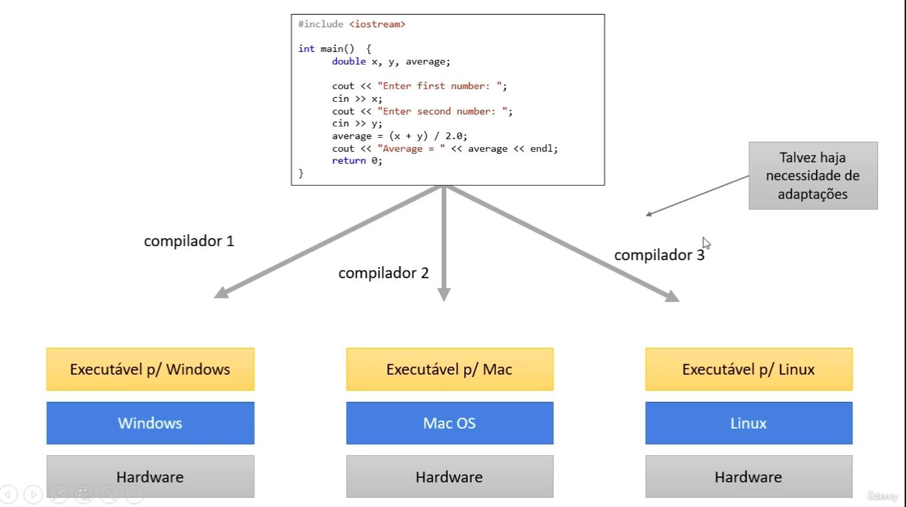
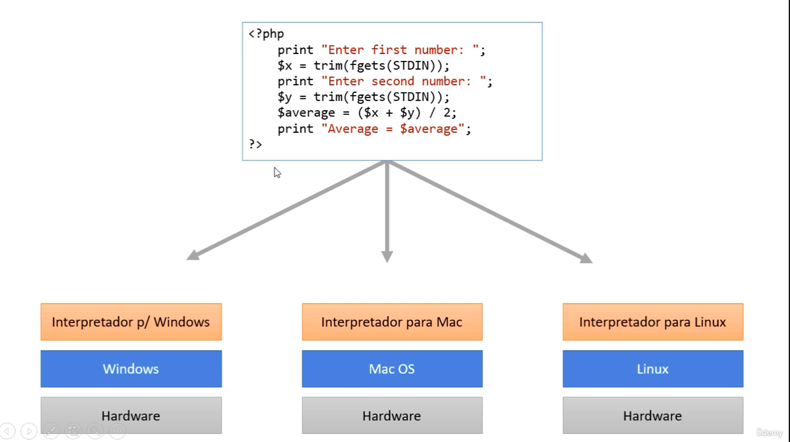
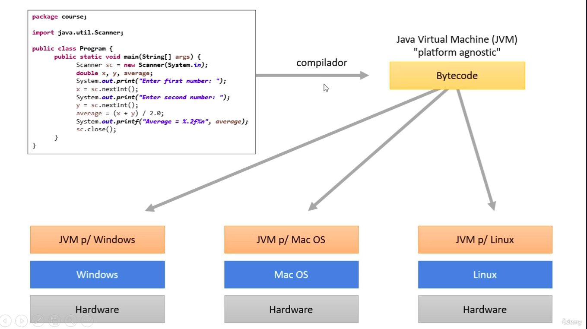
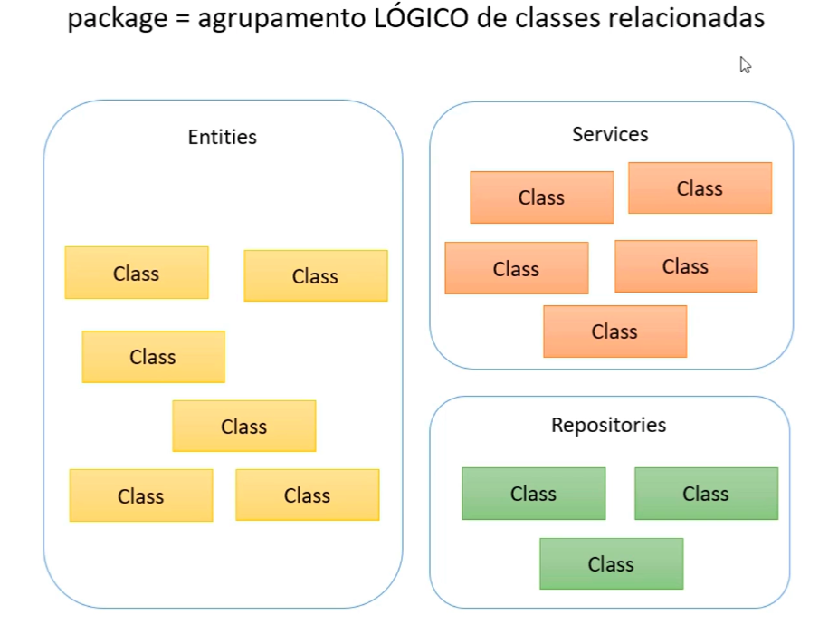
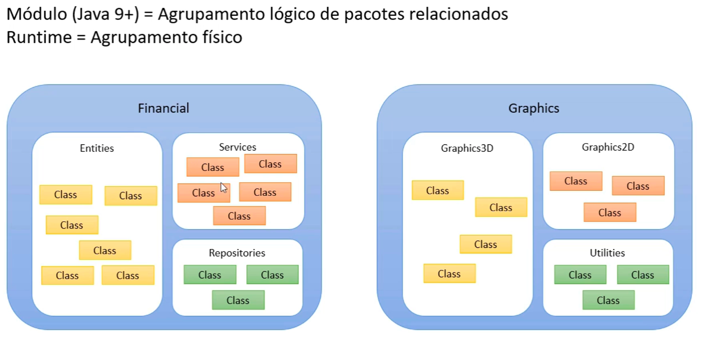
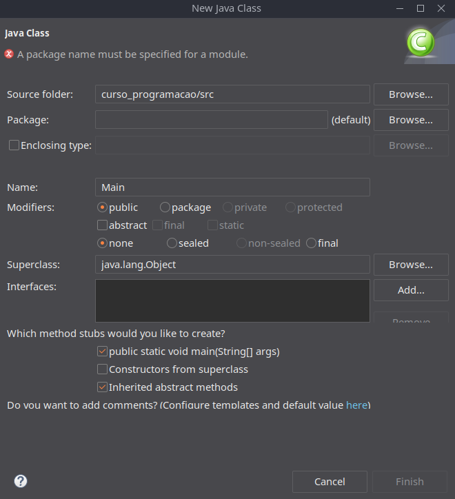

# Lógica de Programação

# <p id="sumario">Sumário</p>

Parte 1: <a href="#introducao-linguagem-java">Introdução a linguagem Java</a>
- <a href="#jvm-jdk">Máquina Virtual do Java: JVM e JDK</a>
- <a href="#estrutura-aplicacao-java">Estrutura da Aplicação Java</a>
- <a href="#primeiro-programa-java">Primeiro Programa Java</a>

Parte 2: <a href="#estrutura-sequencial">Estrutura Sequencial</a>
- <a href="#variaveis-tipos-basicos">Variáveis e Tipos Básicos</a>

---

# <p id="introducao-linguagem-java">Introdução a linguagem Java</p>

**Aspectos**:
- Código compilado para bytecode e executado em máquina virtual (JVM).
- Portável, segura e robusta.
- Roda em diversos dispositivos.

**Edições**:
- Java ME - dispositivos embarcados e móveis.
- Java SE - core - desktop e servidores.
- Java EE - aplicações corporativas.

## <p id="jvm-jdk">Máquina Virtual do Java: JVM e JDK</p>

**JVM - Java Virtual Machine**: Executa sistemas Java.

| **Compilação e Interpretação**                  |                                                                                              |
|-------------------------------------------------|----------------------------------------------------------------------------------------------|
| **Linguagens compiladas**                       | transforma o código fonte em um programa compilado que pode ser executado pelo computador    |
|                                                 | Ex: C e C++                                                                                  |
| **Linguagens Interpretadas**                    | Pega o código fonte e, gradualmente vai interpretando e transformando para código executável |
|                                                 | Ex: PHP e JavaScript                                                                         |
| **Linguagens Pré-compiladas + Máquina Virtual** | Realiza o mesmo processo das anteriores                                                      |
|                                                 | Ex: Java e C#                                                                                |

**Exemplo: Compilação**



**Exemplo: Interpretação**



**Exemplo: Pré-Compilação + Máquina Virtual**



## <p id="estrutura-aplicacao-java">Estrutura da Aplicação Java</p>

Java é uma linguagem POO e a sua base é classe, ou seja, todo código em Java deve estar dentro de uma classe.

**Package**: Agrupamento lógico de classes relacionadas.



**Módulo**: Agrupamento lógico de pacotes relacionados.



## <p id="primeiro-programa-java">Primeiro Programa Java</p>

```bash
src
--| |New
  |--| |Class
```

_Nota: Organização de projetos em pacotes._



```java
/**
 * PONTO DE ENTRADA DE UMA APLICAÇÃO JAVA 
 */
public class Main {

	public static void main(String[] args) {
		// TODO Auto-generated method stub

	}

}
```

<a href="#sumario">Retornar ao sumário</a>

---

# <p id="estrutura-sequencial">Estrutura Sequencial</p>

## <p id="variaveis-tipos-basicos">Variáveis e Tipos Básicos</p>

| **TIPOS PRIMITIVOS** |
|----------------------|

|             Descrição               |          Tipo          |           Tamanho             |
|-------------------------------------|------------------------|-------------------------------|
| Tipos númericos inteiros            | byte, short, int, long | 8bits, 16bits, 32bits, 64bits |
| Tipos numéricos com ponto flutuante | float, double          | 32bits, 64bits                |
| 1 caractere Unicode                 | char                   | 16bits                        | 
| Valor verdade                       | boolean                | 1bit                          |

<a href="#sumario">Retornar ao sumário</a>