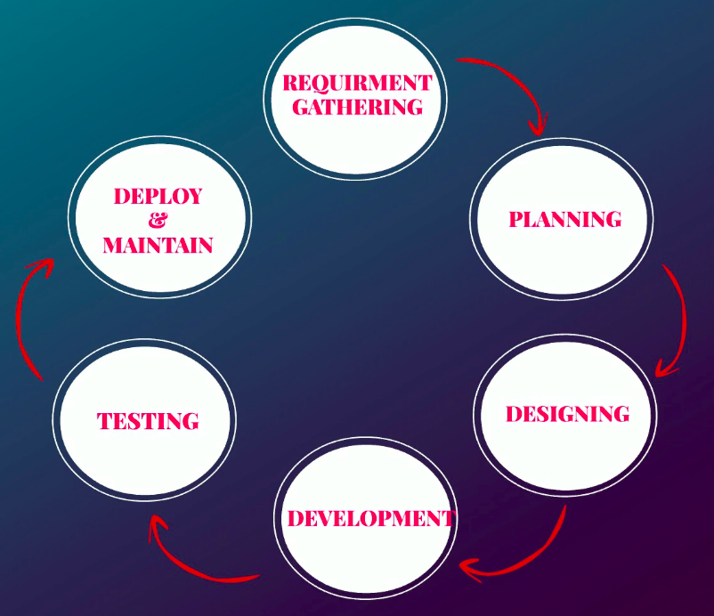
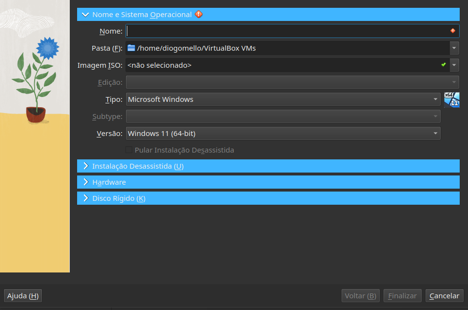
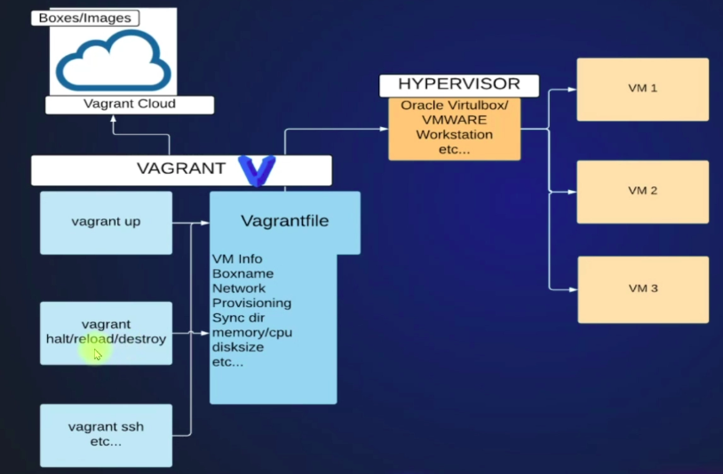

# DevOps Beginners to Advanced with Projects

# 
SUMÁRIO

Parte 1: <a href="#introducao">Introdução aos conceitos de DevOps</a>

Parte 2: <a href="#pre-requisitos-configuracao">Pré-requisitos de configuração</a>

Parte 3: <a href="#vm-Setup">VM Setup</a>
- <a href="#criando-vm-manualmente">Criando VM Manualmente</a>
- <a href="#criando-vm-automaticamente">Criando VM Automaticamente</a>

---

# 
Introdução aos conceitos de DevOps

Fases de Desenvolvimento de um software:
1. Coleta e análise de requisitos.
2. Planejamento.
3. Projeto.
4. Fase de desenvolvimento.
5. Teste de software.
6. Implantação.
7. Manutenção.

Modelos de SDLC:
- **Waterfall**: cada fase deve ser concluída antes que a próxima fazer possa começar.
  - não é muito indicado retorna para os processos anteriores.
- **Agile**: requisitos dividos em partes menores.
  - cada interação tem seu tempo de duração.
- **Spiral**.
- **Big Bang**.

**Integração Continua** - permite desenvolver um software e seus recursos de forma rápida e eficiente.
- Detecta defeitos em um estágio muito inicial, para que não sejam multiplicados.
- automação da criação e do teste do código.

**Entrega Contínua** - processo automatizado de entrega de alterações de código aos servidores de forma mais rápida e eficiente.

Conceitos de Deploy:
1. provisionamento do servidor.
2. instalação de dependências nos servidores.
3. alterações de configurações.
4. alterações nas regras de firewall ou rede.

<a href="#sumario">retorna ao sumário</a>

---

# 
Pré-requisitos de configuração

## AWS SETUP

**AWS Free Tier** - permite o uso base da computação em nuvem sem pagar nada.

| **Etapas para verificar se conta está ativa** |
|-----------------------------------------------|

1. pesquisar por **EC2**.
2. Na próxima janela se os detalhes estiverem zerados é porque a conta está ativa.

| **Etapas para criação de autenticação MFA para usuário root** |
|---------------------------------------------------------------|

1. Pesquisar por **IAM**.
2. Na próxima janela clique para adicionar autenticação MFA para usuário root.
3. Depois atribua a autenticação em **Assign MFA**.
4. Preencha os campos (Instale no celular o **Google Authenticator**):
  - Device name: <nome_serviço>.
  - select MFA device.
  - clicar em next.
5. Escanei o código e insira os 6 dígitos.
6. adicione o serviço.

| **Etapas para criação de user IAM** |
|-------------------------------------|

1. Pesquisar por **IAM**.
2. Buscar por **users**.
3. Clique em `add users`.
4. Preencha os campos:
  - user name.
  - marque a caixa que permite acesso ao console de gerenciamento do AWS.
5. Clique em **I want to create an IAM user**.
6. Em console password, selecione **autogenerated password**.
7. Marque a caixa que permita que o usuário crie uma nova senha.
8. Depois faça o login e clique em next.
9. Em **set permissions**, busque por attach policies directly e de as seguintes permissões ao usuário.
  - `AdministratorAccess`.
10. Seguindo para próxima sessão, crie o usuário.
11. Faça o download do arquivo .csv com os dados do usuário.
12. Copie a URL de acesso do userIAM.
13. Clique para voltar para lista de usuários.
14. Adicionar a autenticação MFA para este usuário em **security credentials**.

| **Definindo valores de faturamento** |
|--------------------------------------|

1. Busca a painel de faturamento no **menu suspenso**.
2. Acesse preferências de cobrança, clique em **preferência de entrega de fatura** e marque a caixa.
3. Depois acesse preferências de alertas, marque a caixa para receber alertas de níveis gratuitos e insira seu email.
4. Marque a caixa para receber **alertas de faturamento do CloudWatch**.

| **Etapas para configuração do serviço CloudWatch** |
|----------------------------------------------------|

1. Busque por cloudwatch > no menu superior encontre a localidade e selecione: **US East (N. Virginia)**.
  - A região representa a localidade de um datacenter.
2. Siga para alarmes, clique em todos os alarmes > crie um novo alarme.
3. Selecione a métrica que deseja definir o alarme > clique na meta de faturamento.
4. Em **cobrança total estimada**, selecione a moeda US e clique para selecionar a métrica > depois definir a valor de 5 dólares.
5. Na próxima página, clique para criar um tópico para receber e-mail > de um nome ao tópico (Ex: <MonitoringTeam>).
6. Forneça um e-mail para receber os alertas > crie o tópico.
7. Forneça um nome para o alarme (Ex: <AWSBillingAlert>) > siga para próximo.
8. Faça a confirmação de e-mail.

| **Etapas para criação de Certificado de segurança** |
|-----------------------------------------------------|

1. Busque por certificate manager > selecione a mesma região da etapa anterior.
2. Clique em **solicitar certificado** > depois selecione **solicitar certificado público**.
3. Fornceça os seguintes dados:
  - nome do domínio: <*.hkhinfo.xyz>
4. Clique na caixa de validação DNS.
5. Adicione uma tag, preencha os campos:
  - Tag key: Name.
  - Tag value: <nome_domínio> (Ex: `*.hkhinfo.xyz`).
6. Clique para solicitar.
7. Valide o certificado clicando em ID > informe o `CNAME name` e `CNAME value` no seu domínio > siga para sua plataforma de domínio (Ex: **Godaddy**).
8. Busque por domínios, e em seguida DNS > Clique em adicionar novo registro.
9. preecha os seguintes valores:
  - Type: CNAME.
  - Name: <CNAME name> (servidor) - **é importante remover a parte do domínio**.
  - Value <CNAME value> (servidor) - **remova o ponto final**.
10. Salve.

<a href="#sumario">retorna ao sumário</a>

---

# 
VM Setup

> OBS: PARA UMA MELHOR SEGURANÇA DE UM SISTEMA, UM SERVIDOR DE BANCO DE DADOS NÃO PODE SER EXECUTADO EM UM MESMO SERVIDOR WEB (ISOLAMENTO).

**VMware** - criou ferramentas que permitem que um computador executasse vários sistemas operacionais.

**Virtualização** - particiona seu recurso físico em um recurso virtual.
- Conceito de virtualização de servidores.

| terminologias |              Descrição                |
|---------------|---------------------------------------|
| Host OS       | Sistema operacional da máquina física |
| Guest OS      | Sistema operacional da máquina vistual |
| VM            | Máquinas virtuais                     |
| Snapshot      | Maneira de fazer backup na máquina virtual |
| Hypervisor    | ferramento que permite a criação de máquina virtuais |

**Tipes de Hypervisor**:
- tipo 1 (Bare Metal) - executado diretamente no computador físico.
    - Utilizado em produção.
    - Pode ser agrupado cluster, fazendo que a operação continue mesmo se uma delas falhar.
- tipo 2 - utilizado apenas para fins de teste e aprendizado.

## 
Criando VM Manualmente

Etapas:
1. Com o Oracle VirtualBox aberto, clique em "Novo" para abrir a janela a baixo.

| **CentOS** |
|------------|

1. Preencha os campos: 
    - **nome** (ex: centosvm).
    - **tipo** (ex: linux).
    - **versão** (ex: red hat 64-bit).
2. configuração de hardware - deixe com os valores padrões.
  - **ram**: 4GB;
  - **Processador**: 2CPU; 
3. configurações de disco rígido - deixe com os valores padrões > confirmar.
4. clique sobre a imagem, selecione as configurações > busque por armazenamento.
5. Encontre **controller: IDE**, e selecione `Empty` > em optical drive busque pelo boot do SO.
6. Marque a caixa **Live CD/DVD** > ok.

| **Ubunto** |
|------------|

1. Preencha os campos: 
    - **nome** (ex: ubuntovm).
    - **tipo** (ex: linux).
    - **versão** (ex: ubunto 64-bit).
2. configuração de hardware - deixe com os valores padrões.
  - **ram**: 4GB;
  - **Processador**: 2CPU; 
3. configurações de disco rígido - deixe com os valores padrões > confirmar.
4. clique sobre a imagem, selecione as configurações > busque por armazenamento (Storage).
5. Encontre **controller: IDE**, e selecione `Empty` > em optical drive busque pelo boot do SO.
6. Marque a caixa **Live CD/DVD** > ok.

| **Etapas de Configuração de Rede** |
|------------------------------------|

1. Vá nas configurações da máquina virtual > busque por redes (Network).
2. Procure a adaptador 2, depois marque a caixa para ativar o adaptador.
3. Preencha os campos:
  - **attached to**: bridged adapter.
  - **Name**: <selecione_adaptador_computador>
4. Por fim, marque a caixa de conexão com o cabo > ok.

| **Etapas de Configuração do Sistema** |
|---------------------------------------|

1. Vá nas configurações da máquina virtual > busque por sistema (System).
2. clique em placa-mãe (motherboard).
3. Preencha os campos:
  - **Pointing Device**: USB table.
4. Ok.

| **Etapas de Configuração do CENTOS** |
|--------------------------------------|

1. Ao iniciar a máquina virtual, selecione **install CentOS Stream 9**.
2. Campos selecionados:
  - **Idioma**: Inglês.
3. Na próxima janela, clique em **installation destination**.
  - selecione o disco virtual > clique em done.
  - retorne para **installation destination**, e selecione o disco novamente.
  - em storage configuration, selecione automatic.
4. Em seguida, clique em rede e hospedagem (Network e Host Name).
5. Na janela irá aparecer dois adaptadores, um é o Nat e o outro é o bridge > selecione o bridge.
6. Preencha os campos:
  - hostname: <nome_vm> (Ex: centosvm) > apply.
  - clique em done.
7. clique em root password > crie uma senha.
8. clique em begin installation.
9. Vá no painel do virtual Box, clique sobre a vm e busque por `Stop` > Shutdown.
10. Quando a vm desligar, vá nas configurações e busque por armazenamento.
11. clique na ISO e remova o disco da unidade virtual.
12. inicie novamente a VM.
13. Nas próxima janelas, preencha os campos:
  - fullname: <nome_vm> (Ex: centosuser).
  - password: <senha_vm>.
  - iniciar o SO.
14. **Entre no terminal** da VM, e digite: `ip addr show`
  - ip vm: `192.168.1.4`.

| **Verificando conexão ssh com VM** |
|------------------------------------|

**Requisitos**: é importante que a instalação da máquina virtual já esteje instalada.
- no caso, após as etapas acima é importante baixar a **ISO** do sistema operacional que será utilizado (Ex: CentOS).

No centOS, digite `ip addr show` para visualizar o ip e o nome de usuário registrados na VM.

Agora no computador físico, faça o teste de conexão via ssh com a vm digitando `ssh userVm@ipVm` (Ex: `ssh centosuser@192.168.1.10`).

Após a conexão, faça um teste digitando os seguintes comandos na máquina física `ip addr show` e depois `hostname`

> OBS: o mesmo processo devo ser realizado para se conectar na vm do Ubunto.
- Ex: `ssh devops@192.168.1.4`.

## 
Criando VM Automaticamente

**Vagrant** - ferramenta de automação de VMs ou gerenciamento de ciclo de vida da VM.
- Utilize ferramentas hipervisor para criar e gerenciar máquinas virtuais.

|      Benefícios     |                     Desrição                        |
|---------------------|-----------------------------------------------------|
| **Instalção do SO** | configura VMs usando imagens de VM, chamadas de BOX |
| **Vagrantfile**     | permite fazer diversas configurações na VM          |
| **Provisionamento** | armazena todas os comandos necessários para VM      |

|     Comandos Básicos     |                                    |
|--------------------------|------------------------------------|
| **vagrant init boxname** | Menciona o nome da caixa           |
| **vagrant up**           | Cria a VM se já estiver disponível |
| **vagrant ssh**          | Login na VM                        |
| **vagrant halt**         | Desliga a VM                       |
| **vagrant destroy**      | Exclui a VM                        |

| **Etapas - Criação Máquina Virtual com Vagrant** |
|--------------------------------------------------|

<a href="#sumario">retorna ao sumário</a>